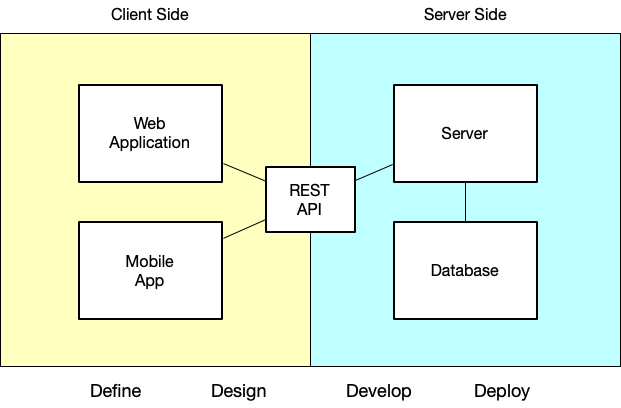
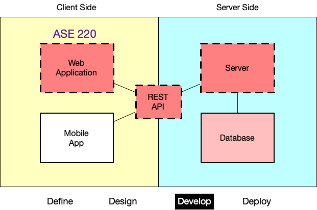
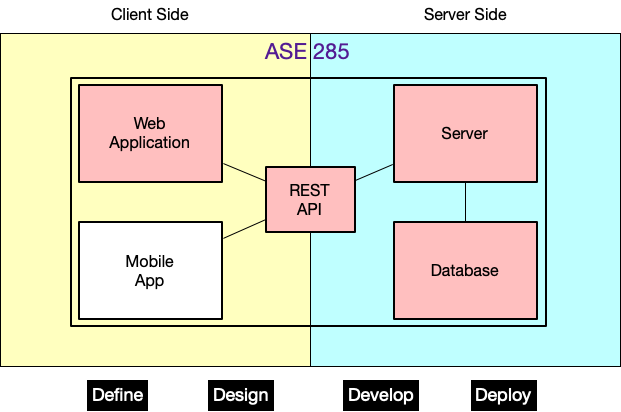
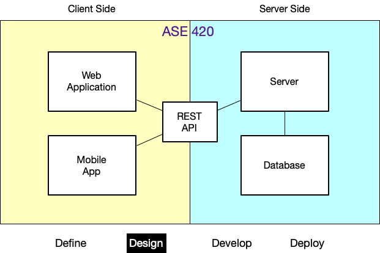

<!-- _class: lead -->
<!-- _class: frontpage -->
<!-- _paginate: skip -->

# The Architecture of the ASE Program

---

## Goal of the ASE Program

- Students build high-quality client/server applications to solve any given software engineering problems.

 
 

---

## 4D: The Tool for SWE Problem Solving

1. **Define** the given problem and optimal solution.
2. **Design** the architecture of the application.
3. **Develop** the application based on the design.
4. **Deploy** the application.

---

## APT: The Goal ASE Students Master

1. How to build High-quality **A**pplications
2. How to apply SWE **P**rocesses
3. How to use SWE Development **T**ools

*ASE students can complete tasks independently or collaboratively.*

---

---

## ASE 220 (Full Stack App)

---

## ASE 230 (Server Side App)

---

## ASE 285 (SE + Security)

---

## ASE 330 (UI/UX)

---

## ASE 420 (Software Design)

---

## ASE 456 (Crossplatform)

---

## ASE 485 (Capstone)

