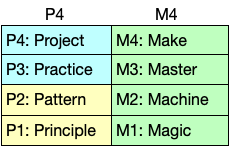
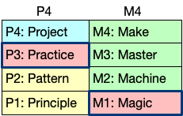
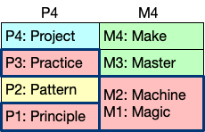
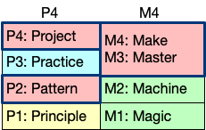

<!-- _class: lead -->
<!-- _class: frontpage -->
<!-- _paginate: skip -->

# P4M4: The Structure of

# Dr.Cho's ASE Courses

---

## Characteristics

1. **Build Real Applications**
2. **Integrated Curriculum**
3. **Theory Emerges from Practice**
4. **Problem Solving with Proven Methods**

---

### 1. **Build Real Applications**

- Each course centers on hands-on projects  
- Students develop working software, not just abstract concepts

---

### 2. **Integrated Curriculum**

- Core ideas are revisited across courses  
- Learning is deepened through varied perspectives

---

### 3. **Theory Emerges from Practice**

- Principles and patterns are discovered through experience  
- Students understand the value of theory through real-world examples

---

### 4. **Problem Solving with Proven Methods**

- Focus on solving problems using  
  time-tested tools, techniques, and SWE principles  
- Students become systematic and confident problem solvers

---

### The Four Learning Levels: M4

- **M1: Magic** – At first, everything feels like magic
- **M2: Machine** – As we learn the theory, things become systems we understand
- **M3: Master** – With practice, we gain mastery
- **M4: Make** – By creating, we internalize what we’ve learned

---

### The Four Activities: P4

- **P1: Principles** – The truths behind the “Machine”
- **P2: Patterns** - Reusable solutions  by “Masters”
- **P3: Practices** – The repeated actions that develop mastery
- **P4: Projects** – What we make to truly learn and integrate everything

---

#### Understanding Theory vs Practice from P4

- Theories: Principles & Patterns
- Application: Practices & Projects

---

##### 🧠 Theories (P1/P2)

- **Principles** – Timeless truths and rules that guide software design  
- **Patterns** – Proven solutions to recurring problems

> Theories help us **understand why** things work.

---

##### 🛠️ Application (P3/P4)

- **Practices** – Repeated actions that develop skills  
- **Projects** – Real-world applications that integrate everything

> Practice helps us **know how** to make things work.

---

##### 🗺️ Analogy

- **Theories** are like a **map** — they guide us through the terrain  
- **Application** is the **journey** — walking the path, learning by doing

> - You need both the map (theories) and the journey (application) to reach your destination.
> - Research shows that starting with the application leads to a deeper understanding of theories.

---

## P4M4 Model

- We can solve any problem when we **know** the principles and patterns—and **understand** how to apply them to create solutions.

---

## Three Phases of the Course

- 📘 Phase 1 (**Weeks 1–2**)
  - Introduction & Setup
- 🛠️ Phase 2 (**Weeks 3–10**)
  - Skill Building through Practice
- 🚀 Phase 3 (**Weeks 11–16**)
  - Capstone Project

---

📘 Phase 1 (**Weeks 1–2**): Introduction & Setup

- Set up tools and development environment  
- Learn basic concepts and workflows

---

### *P3M1 (Practice + Magic)*

---

🛠️ Phase 2 (**Weeks 3–10**): Skill Building through Practice

- Emphasizes the transformation from early intuition to structured knowledge.
- Highlights preparation for the final project.

---

### *P13/M12 (Magic/Machine + Practice/Principle)*

---

🚀 Phase 3 (**Weeks 11–16**): Capstone Project

- Apply what you've learned in a full project  
- Work individually or in teams

> *Start week may be adjusted based on class progress*

---

### *P24/M34 (Master/Make + Pattern/Project)*

