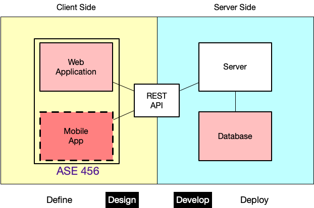
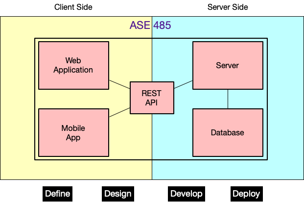

<!-- _class: lead -->
<!-- _class: frontpage -->
<!-- _paginate: skip -->

# Core SWE Skills for ASE Students  

**Essential Tools for Modern App Development**

---

## SWE Tools Level 1 (Introductory)

In 200-level ASE courses, ASE students are expected to have basic familiarity with:

- **SWE Tools**
- **Documentation Formats**
- **Programming Languages**

*Visit <https://github.com/nkuase/ASE> and choose "SWE Tools L1" for detailed guide.*

---

### 🛠 SWE Tools

- **VSCode** – Code editing and extensions  
- **Git & GitHub** – Version control and collaboration  
- **Linux CLI Tools** – Command-line efficiency and automation  

---

### 📄 Documentation Formats

- **Markdown** – Lightweight text formatting for docs and READMEs  
  - **Marp** - Presentation
- **JSON** – Structured data for configuration and APIs  
- **YAML/TOML** – Human-readable configuration and data serialization  

---

### 💻 Programming Languages

- **Java / JVM** – Standard for software engineering  
- **Python** – AI, data science, and automation  
- **JavaScript** – Web development and interactivity

---

## Level 2 (Project)

In 300/400 level ASE courses, students are expected to have basic familiarity with:

- **Team Tools**
- **Project Tools**

---

### Don’t Worry

- It is OK fine if you’re not familiar with these tools **yet**  
- Jump in and start using them for your projects  
- They’re just problem-solving tools  
- With practices, you’ll master these — and more — faster than you think

---

### However

- Learn to **install** and **use** these tools on your own  
- Independent mastery of tools is essential for a software engineering career  
- ASE courses won’t cover tools in depth, but will provide basic instructions and guidelines  

---

### The Good News

- Many high-quality YouTube tutorials are available  
- AI/LLM tools are often helpful (but not always accurate due to hallucinations)  
- Share error messages with AI tools — they can guide you toward solutions  

---

## ASE Courses and SWE Tools

> **Notice:** This list is a guideline; you will use more tools in ASE courses and beyond.
> **Remember:** ASE students are expected to master all these tools (and more) before entering real-world software engineering.

---

- Tools **in bold** are essential and will be used in the course  
- Tools *in italics* are optional or may be discussed  

---

### ASE 220 (API-Client-Server Focus)

  

- **JavaScript**/CSS/HTML  
- **NodeJS**/**MongoDB**

  

  

  

  

---

### ASE 230 (Server-Side Focus)

  

- **PHP** & **MySQL**

REST API Tools:

- **Curl**
- JavaScript/HTML/CSS

**Optional:**

- *Docker* for Deployment

  

  

  

  

---

### ASE 285 (SWE & Security Focus)

  

Programming Language:

- **Node.js**, *React*, *TypeScript*

Database:

- **MongoDB**

Security:

- **PGP**, **SSH**  

  

  

  

  

---

### ASE 330 (UI/UX Focus)

  

Product Design Tools

- Customer persona
- KANO Model
- SCAMPER technique
- TRIZ framework

  

  

  

  

---

### ASE 420 (Software Design Focus)

  

**Python**  

- Virtual environments  
- PIP  
- UV/UXR  
- PyTest  

  

  

  

  

---

### ASE 456 (Crossplatform Focus)

  

- **Flutter/Dart**  
- Databases: **PocketBase**, **Firebase**, SQLite, IndexedDB  

**Optional:**  

- *Electron*  
- *React Native*

  

  

  

  

---

### ASE 485 (Capstone)

  

- Client/server programming  
- Database programming  
- Cross-platform development  
- UX/UI tools  
- Documentation tools  
- Deployment tools

  

  

  

