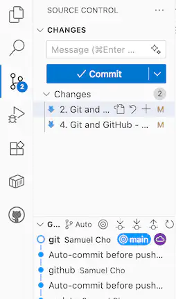
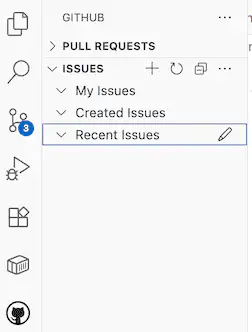
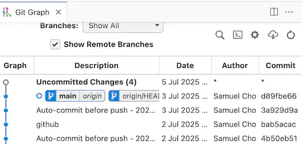

<!-- _class: lead -->

# Git & GitHub

Introduction

---

## The Most Critical Tool You'll Use Every Day

- Under-educated but Overly Used
- Git = #1 Most Widely Used Software Engineering Tool
- GitHub hosts 420+ million repositories

---

- **Professional Necessity**: GitHub portfolio presentation is mandatory - employers expect to see your code, not just hear about it
- **Industry Reality**: Your portfolio presentation must include GitHub because that's where tech professionals showcase their work

---

## Industry Facts

- 90%+ of software companies use Git daily
- Every tech job interview assumes Git knowledge
- Most widely adopted SE tool in the SE industry

---

## The Problem

- Students copy-paste Git commands without understanding
- Professionals mess up repositories due to poor Git knowledge
- Teams lose work because of improper Git usage.
- You're using it wrong if you don't understand WHY.

---

## Why Git? (The Industry Standard)

- Professional Realities
  - "I broke the production code, can I revert safely?"
  - "Who changed this line that caused the bug?"
  - "We need to release yesterday's version immediately."
  - "How do 500 developers work on the same codebase?"

---

- Why Git Dominates
  - **Distributed**: Every developer has full history
  - **Fast**: Millions of files, thousands of developers
  - **Reliable**: Used by Linux kernel, Google, Microsoft
  - **Essential**: You cannot work professionally without it

---

## Why GitHub? (The Collaboration Hub)

- Professional Collaboration
  - **"How do we review code before it goes live?"**
  - **"Where do we track bugs and feature requests?"**
  - **"How do we manage releases and deployments?"**
  - **"Where's our project documentation and wiki?"**

---

- **Why GitHub Rules**
  - **Industry standard**: Open source lives here
  - **Career essential**: Your GitHub = Your portfolio
  - **Hiring tool**: Recruiters check your GitHub profile

---

## What is Git? (The Engine)

- **Distributed version control system** - not just "save versions"
- **Tracks every change** across entire project history

---

- **Enables parallel development** through branching
- **Merges changes intelligently** from multiple developers
- **Well-designed concepts**
  - Repository, Commit, Branch, Merge, and HEAD

---

## What is GitHub? (The Platform)

- **Remote Git hosting** with web interface
- **Code review system** through pull requests
- **Project management** with issues and milestones

---

- **CI/CD integration** for automated testing/deployment
- **Documentation hosting** with wikis and README files
- **Pull Requests**: Industry-standard code review process
- **Actions**: Automated testing and deployment

---

### GitHub as your Resume/Portfolio

- Think of GitHub as your online portfolio or resume for coding.
- When companies or recruiters want to hire software engineers, they often check GitHub to see real examples of their work.  

---

## The Professional Impact

<style scoped>
table { font-size: 22pt !important; line-height: 1.2;}
</style>

| Poor Git Skills | Professional Git Skills |
|-----------------|------------------------|
| Break team repositories | Maintain clean project history |
| Lose work frequently | Never lose code again |
| Can't collaborate effectively | Lead team development |
| Struggle in interviews | Demonstrate technical competence |

---

### It is a Must to Master Git/GitHub

- Every tech company expects Git fluency
- Poor Git skills = Poor developer reputation
- Good Git skills = Professional credibility

---

## Git & GitHub Tools

### Install Git & GitHub

- Use [https://github.com/git-guides/install-git](https://github.com/git-guides/install-git) to install Git.
- Install the Mobile GitHub app
  - You need this for verification later.

---

### Sign up for GitHub

- Make an account at [https://github.com](https://github.com)

- Sign up for [GitHub Student Developer Pack](https://education.github.com/pack).

---

### Visual Studio Extensions

<div class="columns">
  <div class="column">

- Visual Studio Code has excellent built-in Git support, but there are good extensions too.

  </div>

  <div class="column">

  
  
  </div>

</div>

---

#### GitHub Pull Requests

<style>
.columns {
  display: flex;
  gap: 1rem;
}
.column.text {
  flex: 6;
}
.column.image {
  flex: 4;
}
</style>

<div class="columns">
  <div class="column text">

- We can make pull requests in VS Code with the Pull Requests extension.

  </div>
  <div class="column image">


  
  </div>

</div>

---

#### Git Graph (VSCode Extension)

- We can visualize "git log" using the git graph extension.



---

### Diff/Merge Tools

- Visual Studio Code has a built-in diff/merge.
- You can choose any diff/merge tool instead.
  - `WinMerge` is the open-source Windows app.
  - `Meld` is a widely used cross-platform app.

---

### GitHub Desktop Tools

- Download and install [GitHub Desktop](https://desktop.github.com/download/)
- Download and install [Git Tower](https://www.git-tower.com/mac)
  - Request an education license at [Git Tower Education](https://www.git-tower.com/education)

---

## Start Learning Git and GitHub

- Start from [Git and GitHub learning resources](https://docs.github.com/en/get-started/start-your-journey/git-and-github-learning-resources)
- Download and read the free (and the best) Git book: [ProGit](https://git-scm.com/book/en/v2).

---

## GitHub Authentication

- **Two primary methods:**
  1. SSH Keys (recommended for development)
  2. Personal Access Tokens (for HTTPS and API access)

We should be able to access GitHub using both methods, depending on the situation.

---

### Why Do We Need Authentication?

- **Security**: Protect your repositories from unauthorized access
- **Identity Verification**: GitHub needs to know who you are
- **Permission Control**: Different access levels for different users

---

### SSH Keys vs Personal Access Tokens

<style scoped>
table { font-size: 20pt !important; line-height: 1.2 !important;}
</style>

| Feature | SSH Keys | Personal Access Tokens |
|---------|----------|----------------------|
| **Use Case** | Git operations via SSH | HTTPS Git operations, API calls |
| **Security** | Very high (key-based) | High (token-based) |
| **Setup** | One-time setup | Can be regenerated |
| **Scope** | Full repository access | Granular permissions |
| **Expiration** | No expiration | Can set expiration dates |

---

## SSH Keys

- **SSH (Secure Shell) Keys** are cryptographic keys used for secure authentication.
  - **Public Key**: Shared with GitHub (like a lock)
  - **Private Key**: Kept secret on your computer (like a key)
  - **Key Pair**: They work together for authentication

---

**Benefits:**

- No need to enter username/password repeatedly
- More secure than password authentication
- Works seamlessly with Git operations

---

### Check for Existing SSH Keys

Before creating new keys, check if you already have them:

- If you see these files, you might already have SSH keys set up!

```bash
# Check for existing SSH keys
ls -la ~/.ssh

# Look for files like:
# id_rsa.pub (public key)
# id_rsa (private key)
# id_ed25519.pub (newer format)
# id_ed25519 (newer format)
```

---

#### Generate a New SSH Key

**For modern systems (recommended):**

- This is an example, so use your email and key_file.
- -C is for label and -f is for key_file.

```bash
ssh-keygen -t ed25519 -C "chos5@nku.edu" -f id_rsa_nkuase
```

**For older systems:**

```bash
ssh-keygen -t rsa -b 4096 -C "chos5@nku.edu" -f id_rsa_nkuase
```

---

**What happens:**

1. You'll be prompted for a file location (press Enter for default)
2. You'll be asked for a passphrase (enter)
3. Two files will be created: private key and public key (.pub)

---

### Add SSH Key to GitHub

1. Copy the generated pub key in ~/.ssh.
1. Go to GitHub.com and sign in
1. Click your profile picture → **Settings**
1. In the sidebar, click **SSH and GPG keys**

---

5. Click **New SSH key**
1. Give your key a descriptive title (e.g., "My Laptop - Ubuntu")
1. Paste your public key into the "Key" field
1. Click **Add SSH key**
1. Confirm with your GitHub password if prompted

---

### Make ~/.ssh/config

- Copy the following.
  - Replace `nkuase` and `id_rsa_nkuase` with your user name.

```txt
Host nkuase
    HostName github.com
    User git
    IdentityFile ~/.ssh/id_rsa_nkuase
```

---

#### Test Your SSH Connection

- Test if everything is working:
  - username should be your username (mine is nkuase)

```bash
> ssh git@username
PTY allocation request failed on channel 0
Hi nkuase! You've successfully authenticated, 
But GitHub does not provide shell access.
Connection to github.com closed.
```

---

### Using SSH Keys with Git

- Now you can clone and work with repositories using SSH:

```bash
# Clone a repository using SSH
git clone git@github.com:username/repository.git

git clone username:username/repository.git
```

---

## Personal Access Tokens

<style scoped>
li { font-size: 22pt !important; line-height: 1.2 !important;}
</style>

- **Personal Access Tokens (PATs)** are an alternative to passwords for authentication.
- **When to use PATs:**
  - HTTPS Git operations
  - GitHub API calls
  - Command-line tools
  - GitHub Actions
  - Third-party applications (e.g., Tower)

---

**Advantages:**

- Granular permissions (scopes)
- Can be revoked individually
- Expiration dates for security
- No password exposure

---

### Navigate to Token Settings

<style scoped>
li { font-size: 24pt !important; line-height: 1.2 !important;}
</style>

1. Go to GitHub.com and sign in
2. Click your profile picture → **Settings**
3. In the sidebar, scroll down and click **Developer settings**
4. Click **Personal access tokens**
5. Choose **Tokens (classic)** or **Fine-grained tokens** - **Recommendation:** Start with "Tokens (classic)" for simplicity

---

### Generate New Token

1. Click **Generate new token** → **Generate new token (classic)**
2. Give your token a descriptive name
3. Set an expiration date (recommended: 90 days or less)
4. Select scopes (permissions) based on your need

---

## Creating a Repository

- **Method 1: GitHub First**
  1. GitHub.com → **"New repository"**
  2. Set name, description, visibility
  3. Initialize with README, .gitignore, and license
  4. Clone to local: `git clone <URL>`

---

- **Method 2: Local First**
  1. `git init` locally
  2. Create repo on GitHub (empty)
  3. Connect: `git remote add origin <URL>`
  4. Push: `git push -u origin main`

---

### Practice

Practically in all ASE courses, we use GitHub for project management.

- Use this course as an opportunity to get comfortable with Git and GitHub.
- Showcase your projects on GitHub and turn them into a portfolio.
