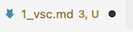
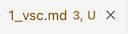
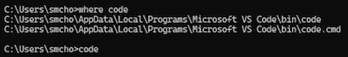
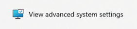
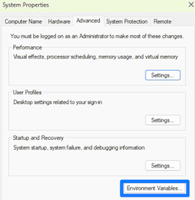
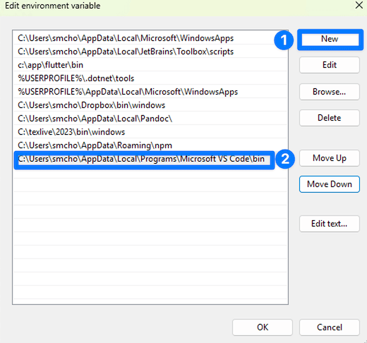

<!-- _class: lead -->
<!-- _class: frontpage -->
<!-- _paginate: skip -->

# VS Code - The First Step

---

## What is VSCode (Visual Studio Code)

It is an IDE (Integrated Development Environment) for you to do (almost) anything with it.

1. File Explorer
2. Text Editor
3. Git/GitHub Access Tool
4. Terminal
5. ... Anything with VSCode Extensions.

---

## 1. Installation & Setup

### Download & Install

1. Go to [code.visualstudio.com](https://code.visualstudio.com)
2. Download for your OS (Windows/Mac/Linux)
3. Run the installer with default settings

---

### First Launch

- Open VS Code from Start Menu (Windows) or Applications (Mac)
- You'll see the Welcome screen with helpful getting-started guides

---

## 2. Opening Your Project

### Method 1: File Menu

```bash
File → Open Folder → Select your project directory
```

### Method 2: Drag & Drop

- Simply drag your project folder into the VS Code window

---

### Method 3 (Optional): Terminal/Command Line

Read the Optional section if you want to use a command line tool `code`.

```bash
# Navigate to your project folder
cd /path/to/your/project
# Open current directory in VS Code
code .
```

---

## 3. Command Palette - Your Best Friend

**Shortcut**: `Ctrl+Shift+P` (Windows/Linux) or `Cmd+Shift+P` (Mac)
For Mac users, always use `Cmd` for `Ctrl`.

### What is it?

- Central hub for ALL VS Code commands
- Type what you want to do, VS Code finds it

### Examples:

```txt
> Open Settings
> Git: Clone
> Markdown: Open Preview
> Python: Run Python File
```

---

## 4. Essential Extensions

### How to Install Extensions

1. Click Extensions icon in sidebar (📦) or press `Ctrl+Shift+X`
2. Search for extension name
3. Click "Install"

---

## 5. Usage and Tips

Shortcuts are easy to use, but you can always use Command Palette (view -> Command Palette) and give a command name to get the same results.

### 1. File Explorer Tips

- `Ctrl+P` - Quick file open
- `Ctrl+Shift+E` - Focus on Explorer
- Right-click for context menus

---

### 2. Integrated Terminal

- `` Ctrl+` `` - Toggle terminal
- `Ctrl+Shift+`` ` - New terminal
- Multiple terminals supported

### 3. Split Editor

- `Ctrl+\` - Split editor
- `Ctrl+1,2,3` - Focus different editor groups
- Drag tabs to rearrange

---

## 4. Essential Keyboard Shortcuts

| Action          | Windows/Linux  | Mac           |
|-----------------|----------------|---------------|
| Command Palette | `Ctrl+Shift+P` | `Cmd+Shift+P` |
| Quick Open      | `Ctrl+P`       | `Cmd+P`       |
| Toggle Terminal | `` Ctrl+` `` | `` Cmd+` `` |
| Save | `Ctrl+S` | `Cmd+S` |
| Find | `Ctrl+F` | `Cmd+F` |
| Replace | `Ctrl+H` | `Cmd+Alt+F` |
| Comment Line | `Ctrl+/` | `Cmd+/` |

---

## 5. Common Beginner Mistakes to Avoid

❌ **Don't**: Open individual files instead of the project folder
✅ **Do**: Always use "Open Folder" for projects

- This is an important concept when you use VSCode.
- VSCode is an IDE, not an editor.

---

❌ **Don't**: Ignore the red squiggly lines (errors)
✅ **Do**: Hover over them to see what's wrong

❌ **Don't**: Forget to save your work
✅ **Do**: Use `Ctrl+S` frequently or enable auto-save  

When a file is not saved, VSCode displays a circle mark; you should make sure it is a cross mark, meaning the file is saved.

not saved -> 
saved -> 

---

# (Optional) VSCode code CLI

---

## What is "code" CLI?

The code command opens Visual Studio Code from the terminal, allowing you to launch files, folders, or projects with optional customization flags.

### Installation & Setup

- On Windows and Mac, installing VSCode usually adds the `code` command automatically.
- On Mac/Linux, you may need to run `Shell Command: Install 'code' command in PATH` from VSCode’s Command Palette to enable it.

---

### Adding code to PATH (Windows)

On Windows, you should add `code` to your PATH environment.

1. In Terminal, run `where code` to find the location of `code`.



---

2. Open `View advanced system settings` and Open `Environment Variables`.




---

3. Add the path to the dialog box.



---

## Use code on Terminal

When `code` program is in your path, you can open VSCode using command line.

- This example shows how we can open the `ASE` directory using `code` on a command line.

```bash
code ASE230
```
