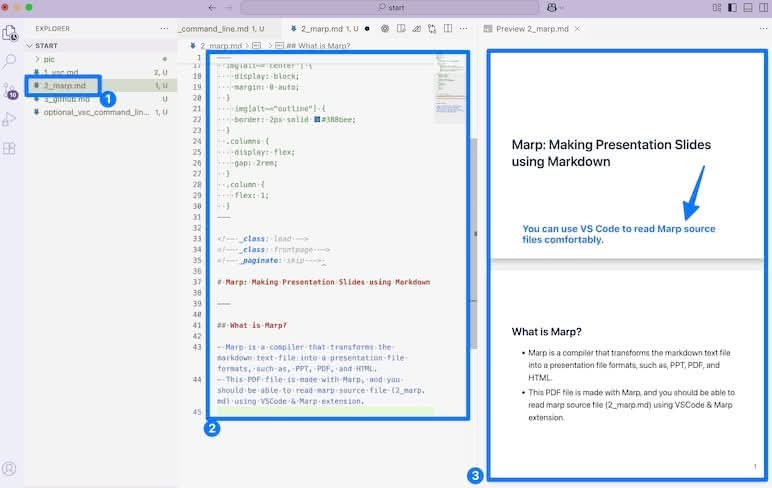
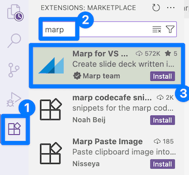
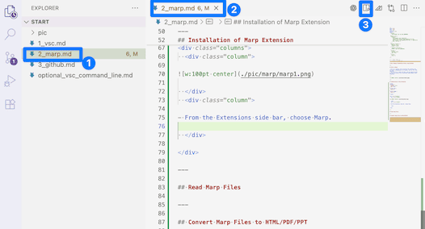
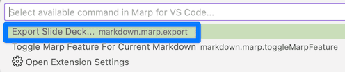

<!-- _class: lead -->
<!-- _class: frontpage -->
<!-- _paginate: skip -->

# Marp: Making Presentation Slides using Markdown

---

## What is Marp?

- Marp is a compiler that transforms the markdown text file into presentation file formats, such as PPT, PDF, and HTML.
- This PDF file is made with Marp, and you should be able to read the marp source file (2_marp.md) using VSCode & Marp extension.

---

---

## Installation of Marp Extension

  

  

  

- From the Extensions sidebar, choose Marp.

  

---

## Read Marp Files

  

  

  

- Choose the marp file (.md file) to read, and click the Marp Preview button.

  

---

## Convert Marp Files to HTML/PDF/PPT

1. Choose the converter menu. 

2. Choose "Export Slide Deck".

3. Choose the format that you want to convert.

---

## For the ASE courses

1. When reading MD (Marp/Markdown format) files (homework or project files), use VSCode and the preview menu to read the files.
2. When reading PDF files, you can use the `VSCode PDF extension` to read the PDF files.
3. When making code, you can use any programming extensions, and use the terminal to compile & run code.

In short, you can use VSCode to complete any ASE course activity.

---

## Exercise

This directory has all the Marp source files.

- Use VSCode and the Marp extension to read markdown files.
- Use them to convert the Marp (md) files into PDF files.
