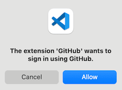

<!-- _class: lead -->
<!-- _class: frontpage -->
<!-- _paginate: skip -->

# Git & GitHub: Share/Sync Files Quickly and Securely

---

## What is Git?

- **Version control system** (like "Track Changes" but smarter)
- Runs on **your computer**
- Tracks **changes in your code**
- Works **offline**

---

## What is GitHub?

- **Online platform** for Git repositories
- **Cloud storage** for your code
- **Collaboration** with others
- **Portfolio** for your projects

Most of the code and documentation for ASE courses are stored in GitHub.

For example, common ASE course material can be accessed in <https://github.com/nkuase/ASE>.

---

## Installation of Git (Windows)

### Step 1: Download Git

- Go to the official Git website: [https://git-scm.com](https://git-scm.com)  
- Click **Download**.  
- The website automatically detects your OS (Windows, macOS, or Linux).  

---

## Step 2: Install on Windows

1. Run the downloaded installer (`.exe`).  
2. Follow the setup wizard:  
   - Use **default options** unless you know you need changes.  
   - Make sure *"Add Git to PATH"* is selected.  
3. Finish and restart your terminal/command prompt.  

---

## Installation of Git (Mac)

1. Install brew (<https://brew.sh>)
2. Use brew to install `git`.

```bash
brew install git
```

---

## VSCode as the Git Tool

- You can think of Git as a client to access the Server (GitHub).
- VSCode knows how to deal with git, and we can use git in VSCode.

  

---

## Download files from GitHub

1. You can go to the GitHub repository to access the files.
2. In this example, you can visit the ASE repository <https://github.com/nkuase/ASE> to download common files.

- The lecture directory has all the markdown source files.
- The PDF directory has all the converted PDF files.


---

### Download the ZIP file

We can download the whole repository using the "Download ZIP" menu.


---

### Clone (sync) with `git clone` command

- You can get the repository location from the menu.


- You can clone any repositories in VSCode or using your terminal (explained in the "Cloning with VSCode" section).

---

## Creating a Public Repository

### Step 1: Login to GitHub

1. Go to [github.com](https://github.com)
2. Sign in to your account
3. If you don't have an account, create one (free)

---

### Step 2: Create New Repository

1. Click the **Repositories Tab**.
2. Select **"New"**


---

### Step 3: Repository Settings

- **Repository name**: `my-first-repo` (example)
- **Description**: "Learning Git and GitHub basics"
- **Visibility**: Select **"Public"** ✅
- **Initialize**: Check **"Add a README file"** ✅
- **Add .gitignore**: Select appropriate template (optional)
- **License**: Choose a license (optional)

---

### Step 4: Create Repository

1. Click **"Create repository"** button
2. **Repository URL**: `https://github.com/yourusername/my-first-repo`

### What you get:

- Public repository accessible to everyone
- README.md file for documentation
- Git history tracking

---

## Cloning with VSCode

### Step 1: Open VSCode and Find Repository

1. Open **VSCode**

2. Using the VSCode Start Menu, you can choose "Clone Git Repository"


---

3. (Optional) You can also clone the repository using Command Palette.

Press `Ctrl+Shift+P` (Windows/Linux) or `Cmd+Shift+P` (Mac)

Type: **"Git: Clone"** and press Enter


---

### Step 2: Enter Repository URL

1. In the menu, click "Clone from GitHub" and select the repository you made.


2. (Optional) You can also paste your repository URL (for example):

```bash
https://github.com/YOUR_ID/my-first-repo.git
```

3. Press **Enter**

---

4. VSCode may ask you to sign in to your GitHub account.



5. (After signing in) Choose a **local folder** where you want to save the project

---

### Step 3: Open Cloned Repository

1. VSCode will ask: **"Would you like to open the cloned repository?"**
2. Click **"Open"**
3. Your repository files will appear in the Explorer panel.
4. When the prompt appears, you can choose to "Trust Folder & Enable All Features" to grant full functionality to the workspace.

### What you see:

- README.md file
- .git folder (hidden - contains version history)
- .gitignore file (hidden - if you chose to make one)

---

## (Optional) Cloning with VSCode 2: Using Terminal

1. Open **Terminal** in VSCode (`Ctrl+``)
2. Navigate to the desired directory:

   ```bash
   cd /path/to/your/projects
   ```

3. Clone repository:

   ```bash
   git clone https://github.com/yourusername/my-first-repo.git
   ```

4. Open folder in VSCode:

   ```bash
   code my-first-repo
   ```

---

## Making Your First Changes

1. Open the `README.md` file in VSCode

2. Add any content (for example):

   ```markdown
   # My First Repository
   
    ...
   ```

3. VSCode will show that there is a change to commit (to local) & pull (to GitHub).


---

### Commit the Change (to local repo)

1. Click the **Source Control** icon in sidebar (or `Ctrl+Shift+G`)
2. You'll see the **"Changes"** section with modified files
4. **Commit**: Enter commit message and click **"Commit"**


---

### Push the Change (to remove GitHub repo)

1. When you push your changes to GitHub, click "Sync Change" or the "push" button (red rectangles).


2. When you pull others' changes to your local repository, click the "pull" button (blue rectangle).

---

### (Optional) Resolving Possible Multiple GitHub Ids Issue

When you have multiple GitHub IDs, you may have the following error:

```txt
remote: Permission to nkuase/my-first-repo.git denied to prosseek.
fatal: unable to access 'https://github.com/YOURID/my-first-repo.git/': The requested URL returned error: 403
```

In the terminal, use this command. Change YOURID and YOUR_REPOSITORY accordingly.

```bash
git remote set-url origin https://YOURID@github.com/YOURID/YOUR_REPOSITORY.git
```

---

### Git is one of the most essential tools

- In the real world, Git/GitHub are used for sharing information everywhere.
- It is essential to use Git/GitHub.
  - Clone the repository.
  - Make a repository.
  - Upload (push) or Download (pull) repository.

- In the ASE program, Git/GitHub is widely used for projects, and we learn ASE 285 in detail.
