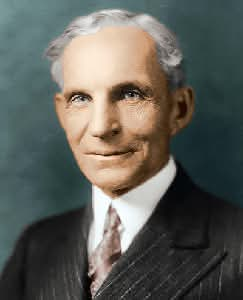

<!-- _class: lead -->
<!-- _class: frontpage -->
<!-- _paginate: skip -->

# SWE Courses Introduction

To become competent, we must understand what works—and what doesn’t.

---

## Proven Facts

- We learn by **doing**.
- We learn by **making mistakes**.
  - Wise people also learn from **others' mistakes**.
- The brain is like a muscle:
  - If we don’t **use** it, we **lose** it.

---

## Software Engineering (SWE)

- It's about **Solving Problems (SP)** — effectively and efficiently.
  - The problem domain is the **Real World**.
- In SE, we solve problems with:
  - **Rules** (principles, patterns)
  - **Tools** (design, process, languages, frameworks, testing)
  - **Teams** (collaboration, communication)

---

## Software Engineers

- They are **professional problem solvers**.
  - Not coders. Not programmers.
- They solve problems **systematically** in a **team**.
- They deliver **real high-quality products** that people:
  - **Use**, **need**, and **pay for**.

---

## Henry Ford Quotation

  

  

> "Whether you think you can, or you think you can’t — you’re right."
  

  

  

  

- Success begins with **belief** in action: **do it now** and make it **better**.
- You **can** do anything—**if you decide to** and willing to **pay the price**.
- What’s **your** decision? Are you willing to **pay the price**?

---

## Henry Ford's PS

  

  

- Use a **system** and **process**, not habits or whims.
- **Continuous improvement** of the system and process.
- **Simplify** and **Automate** everything.
- Make decisions based on **rules and data**.

  

  

  

  

---

## Feynman Quotation

  

  

> “What I cannot create, I do not understand.”

  

  

  

  

 

- Making is the only path to **understanding**, especially in SE.
- The sooner you realize this, the **sooner** you’ll succeed.

---

## Feynman's PS Technique

1. Write down the **problem**.
2. **Think** very hard.
3. Write down the **solution**.

- His point is clear: If you can’t **define** the problem, you can’t solve it.
- Thinking hard is not possible when we don't know what to think.

---

## Recommendation

- Accept that only you can truly teach yourself.
- Real learning begins only when you build something.
- Learning takes time; start early to discover what you don’t know and begin to find answers.
