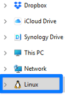

<!-- _class: lead -->
<!-- _class: frontpage -->
<!-- _paginate: skip -->

# 🐧 Installing and Using WSL2 on Windows

Setting up **WSL2** (Windows Subsystem for Linux 2) on Windows.

---

## Tools Installation

1. Install WSL2 → so you have Linux running on Windows.
2. Install Windows Terminal → so you have a modern terminal app to manage multiple shells.
3. Use WSL2 on Windows Terminal → so you can run your Linux environment inside the terminal with tabs, customization, etc.

---

### 💻 Prerequisites

- Windows 10 (Version 2004+) or Windows 11
- Administrator access
- PowerShell
- Windows Terminal
- Internet connection

---

## ✅ WSL2

- Allows you to run a **Linux environment on Windows**
- WSL2 is the second version with:
  - Full Linux kernel
  - Improved performance
  - Better compatibility with Docker and tools

---

## Install WSL2

### ⚙️ Step 1: Enable WSL

Open PowerShell as Administrator and run:

```powershell
wsl --install
```

#### Just in case (Not recommended)

> On older versions, enable features manually:

```powershell
dism.exe /online /enable-feature /featurename:Microsoft-Windows-Subsystem-Linux /all /norestart
dism.exe /online /enable-feature /featurename:VirtualMachinePlatform /all /norestart
```

---

### 🔁 Step 2: Restart Your Computer

After enabling features, restart your system.

---

### 🐧 Step 3: Install a Linux Distro

Install a distro from Microsoft Store:

- Ubuntu (Recommended, all explanations are based on Ubuntu)
- Debian
- Kali Linux
- Alpine WSL

Example:

```powershell
wsl --install -d Ubuntu
```

---

### 🧠 Step 4: Set WSL2 as Default Version

```powershell
wsl --set-default-version 2
```

You can also set it per distro:

```powershell
wsl --set-version Ubuntu 2
```

---

### 🔍 Step 5: Verify Installation

Check installed distros and versions:

```powershell
wsl -l -v
```

Expected output:

```powershell
  NAME      STATE           VERSION
* Ubuntu    Running         2
```

---

## 📦 Windows Terminal

- **Tabs & Multiple Profiles**  
  Run Linux (WSL2), PowerShell, and Command Prompt in one window

- **Customizable Themes & Fonts**  
  Make your terminal match your style

- **Better Text Rendering**  
  Smooth, clear output with GPU acceleration

- **Split Panes**  
  Work in multiple shells side-by-side

---

### **1. Microsoft Store (Recommended)**

1. Open **Microsoft Store**.
2. Search for **"Windows Terminal"**.
3. Click **Install**.

---

### **2. PowerShell**

You can use Command Prompt (cmd.exe) or Windows PowerShell.

- Some installs need system-level changes, so opening PowerShell or cmd.exe as Administrator avoids permission errors.

```powershell
winget install --id Microsoft.WindowsTerminal -e
```

---

## 🧑‍💻 Using WSL2

Use WSL2 in Windows Terminal

1. Open Windows Terminal
2. Click the ▼ menu → Select your Linux distro (e.g., Ubuntu)
3. Start running Linux commands inside Windows Terminal!

---

### 📁 File System Access

- (From WSL2) Windows files available at `/mnt/c/`
- (From Windows) Linux drive can be accessed from "Linux" in the File Explorer sidebar.
- You can access the directory using UNC path (for example, \\\wsl.localhost\Ubuntu-22.04\) in the File Explorer.



---

#### Just in Case (Not Recommended)

If you need to mount the .vhdx in Disk Management, ensure the Linux drive is attached.

- (From Windows) Linux files at:  
  "%USERPROFILE%\AppData\Local\Packages\...\LocalState\ext4.vhdx"
  - That ... is your WSL Linux distribution’s package folder name.
  - For Ubuntu, it starts with "CanonicalGroupLimited.Ubuntu"

---

1. Close all WSL2 (wsl --shutdown).
2. Press Windows + R, type diskmgmt.msc, press Enter (Run as Administrator).
3. In Disk Management, go to Action → Attach VHD.
4. Browse to the .vhdx file and open it.
5. Windows will mount it as a network drive.

---

## 🎯 Summary

- WSL2 brings a whole Linux kernel to Windows
- Great for dev workflows, scripting, Docker, and tools
- Easy to install and use

---

### 🙌 You're Ready

Enjoy Linux on Windows 🎉 
Explore your dev workflow with the best of both worlds.
