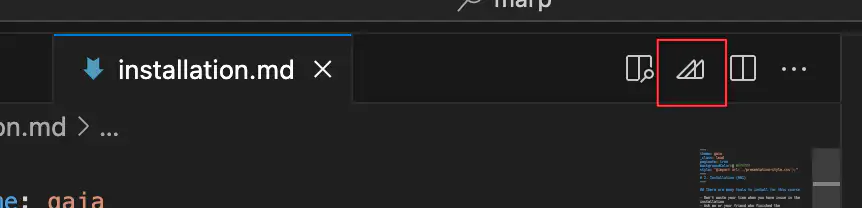

<!-- _class: lead -->
<!-- _class: frontpage -->
<!-- _paginate: skip -->

# Introduction to Marp

Markdown Presentation Ecosystem

---

## What is Marp?

**Marp = Markdown + Presentation**

- Write in simple Markdown syntax
- Get professional-looking slides automatically
- This presentation slide is made with Marp.

---

### Building a House vs. Building with LEGO

**Traditional Presentation Tools (PowerPoint, Google Slides)**

- Like building a house from scratch
- Every room needs individual design
- Time-consuming decoration and formatting

---

**Marp**

- Like building with LEGO blocks
- Pre-designed components that fit together
- Focus on content, not formatting

---

## Why Use Marp?

**Version Control Friendly**

```bash
git add presentation.md
git commit -m "Updated project presentation"
```

---

**Developer-Friendly Workflow**

- Same tools as coding (VS Code, Git, etc.)
- No binary files to worry about

**Consistent Styling**

- One theme, all slides look professional
- No manual formatting inconsistencies

---

**Fast Content Creation**

- Focus on what you want to say, not how it looks
- No clicking through menus

**Easy Collaboration**

- Text-based = easy to merge changes
- Review presentations like code reviews

---

**Platform Independent**

- Works on any system with a text editor
- Export to PDF, HTML, PowerPoint

**Based on Markdown**

- No learning necessary
- Easy conversion from existing Markdown documents

---

## Basic Marp Syntax Examples

YAML is used for the header (frontmatter).

- With this YAML header, the Markdown file becomes the Marp slides.

```markdown
---
marp: true
theme: default
---
```

---

The content is written in Markdown.

```markdown
# Title Slide
## Subtitle

---

# Second Slide
Content goes here
```

---

- Key Points:
  - `---` separates slides
  - `#` creates slide titles
  - First slide is special (title slide)
  - We can use HTML comment as Marp comment `<!-- ... -->`

---

Marp Features - Code Blocks

- Perfect for software engineering presentations!
  - Syntax highlighting automatically applied
  - Code is readable and professional
  - Easy to copy-paste working examples

```python
def hello_world():
    print("Hello, World!")
    return "Welcome to programming!"

# Call the function
message = hello_world()
```

---

## How to compile this page in Marp for VSCode Extension

- Click the Marp button.
- Choose `Export Slide Deck`.
- Choose any option: PDF, PPT, HTML.



---

## Marp vs Traditional Tools

<style scoped>
table { font-size: 20pt !important; line-height: 1.2 !important;}
img { border: 0pt !important; }
</style>

| Feature | PowerPoint | Google Slides | Marp |
|---------|------------|---------------|------|
| Version Control | ❌ | ❌ | ✅ |
| Code Syntax | ⚠️ | ⚠️ | ✅ |
| Collaboration | ⚠️ | ✅ | ✅ |
| Speed | ⚠️ | ⚠️ | ✅ |
| Platform Free | ❌ | ⚠️ | ✅ |
| Developer Workflow | ❌ | ❌ | ✅ |

---

## Perfect for Software Engineering

**Technical Presentations**

- Code examples with syntax highlighting
- Architecture diagrams (with Mermaid)
- API documentation

---

**Project Presentations**

- Easy to update with project progress
- Version controlled with your code
- Team can contribute via pull requests

**Documentation**

- Living documentation that stays updated
- Export to multiple formats

---

## Installation

Option 1: VS Code Extension

1. Install "Marp for VS Code" extension
2. Create `.md` file with `marp: true` header
3. Preview and export icons are created.

Option 2: Marp CLI

```bash
npm install -g @marp-team/marp-cli
marp presentation.md --pdf
```

---

## Best Practices for Marp

**Keep It Simple**

- One main idea per slide
- Use bullet points for clarity
- Don't overcrowd slides

---

**Use Consistent Structure**

```markdown
# Main Topic
## Key Point
- Supporting detail
- Example or evidence
```

**Version Your Presentations**

- Save in Git repository
- Tag important versions
- Document major changes

---

## Creating Custom Marp templates

- Create a `Marp` directory in the VSC project.
- Make the css file in it.

```css
@import 'gaia';
section { 
  background: ...
  color: #1a202c; 
  line-height: 1.6; 
}
```

---

### Visual Studio configuration

Create a `.vscode\settings.json` in the VSC project.

- Point to the location where the Marp themes are located.

```json
  "markdown.marp.themes": [
    "Marp/presentation_style.css",
    "Marp/smalltalk_style.css",
    "Marp/practice_style.css",
    "Marp/project_style.css",
    "Marp/base_style.css",
  ],
  "markdown.marp.pdf.outlines": "both",
  "markdown.marp.html": "all",
  "markdown.marp.exportType": "html",
```

---

### Compilation using CLI

marp is the CLI tool.

- --theme specifies the css theme
- -o specifies the output.

```bash
marp slide-deck.md --theme ./themes/custom-theme.css -o output.html
```

---

| Output Format | Command Example                                                      |
|---------------|---------------------------------------------------------------------|
| HTML          | `marp slide.md --theme custom.css -o slides.html`                   |
| PDF           | `marp slide.md --theme custom.css --pdf`                            |
| Multiple CSS  | `marp slide.md --theme-set style1.css style2.css -o slides.html`    |

---

## Resources

- Official Documentation
  - [Marp Official Site](https://marp.app/)
  - [Marp GitHub](https://github.com/marp-team/marp)
