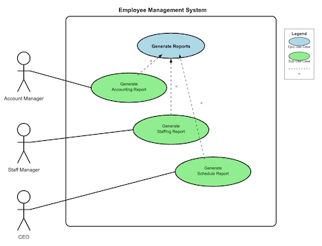

<!-- _class: lead -->
<!-- _class: frontpage -->
<!-- _paginate: skip -->

# Requirements and Use Case Diagrams

**Building software that users actually need**

---

## From Requirements to Visual Models

- Requirements tell us what the client wants and guide software development.
- They are a key communication tool between clients and engineers.

---

Think of requirements like a recipe:

- Actor-Goal Format: Who wants what, and why?
- Use Case Diagrams: A visual recipe showing all the roles and steps involved.

---

### Real Example: Employee Management System

<style scoped>
code { font-size: 15pt !important; line-height: 1.2 !important;}
</style>

```txt
Epic requirement: 
As an "employer," 
I want to "generate reports" 
so that "I can manage my employees." 

Sub requirement 1: As an "account manager,"
I want to "generate an accounting report (name + salary),"
so that "I can track monthly payments."

Sub requirement 2: As a "staff manager,"
I want to "generate a staffing report (name + job title),"
so that "I can track my team."

Sub requirement 3: As a "CEO,"
I want to "generate a schedule report (shift times),"
so that "I can track working hours."
```

---



---

## Why Use Case Diagrams Matter

<style scoped>
li { font-size: 26pt !important; line-height: 1.2 !important;}
</style>

Visualizing Requirements

- **Improved Communication:**  
  - Everyone can see and understand what's needed.
- **Complete Coverage:**  
  - Ensures no features are missed.

---
<style scoped>
li { font-size: 28pt !important; line-height: 1.5 !important;}
</style>

Foundation for Architecture & Design

- Defined Boundaries:
  - Clarifies what each module does and how they interact.
- Testing Reference:
  - Acts as a checklist to verify every module works as intended.
