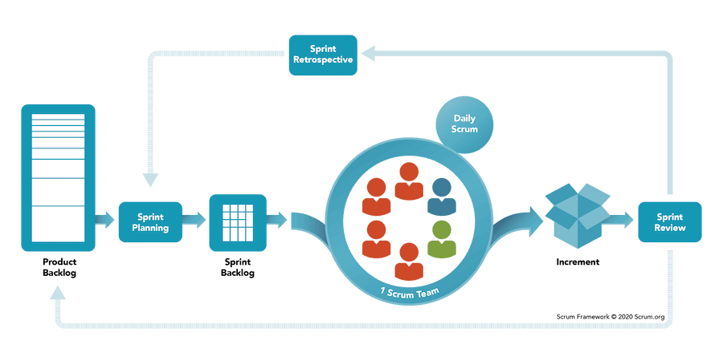

<!-- _class: lead -->
<!-- _class: frontpage -->
<!-- _paginate: skip -->

# Software Process

The 2nd Most Important SWE Tool

---

## What is a Software Process?

**Software Process = Recipe for Building Software**

- **Set of activities** organized to produce software
- **Defines WHO does WHAT, WHEN, and HOW**
- **Ensures quality and predictability**
- **Coordinates team efforts**

**Think of it as:**

- A cookbook for software development teams
- An Orchestra to make a beautiful sound (the leader is the conductor)

---

## Why Do We Need Software Processes?

- **Without Process:** Chaos, confusion, missed deadlines, poor quality, conflicts  

- **With Process:** Clarity, teamwork, predictable results, quality, happy customers  

---

## The Agile Process

**Delivers better, faster, and adaptable software**

- Frequent updates keep products current  
- Iteration + testing improve quality  
- Rapid fixes reduce downtime  
- User feedback drives relevance  

---

### Traditional vs. Agile: Two Different Philosophies

| **Traditional (Waterfall)** | **Agile**                    |
|-----------------------------|------------------------------|
| Plan everything upfront     | Plan as you learn            |
| Big design, then build      | Small designs, build quickly |
| Documentation heavy         | Working software focused     |
| Sequential phases           | Iterative cycles             |
| Resist changes              | Embrace changes              |

---

### Traditional Waterfall: Building a Bridge

**Like civil engineering:**

- Plan every detail before construction
- Can't change the foundation later
- Expensive to modify once built
- Works well for predictable projects

**Waterfall Phases:**

1. Requirements → 2. Design → 3. Implementation → 4. Testing → 5. Deployment

---

### Agile: Building a Startup

<style scoped>
li { font-size. 24pt !important; line-height: 1.3 !important;}
</style>

**Like entrepreneurship:**

- Start with a basic idea
- Build a minimum viable product (MVP)
- Get customer feedback
- Adapt and improve quickly
- Learn by doing

**Perfect for:** Software projects with changing requirements

---

## The Agile Manifesto (2001)

**Four Core Values:**

1. **Individuals and interactions** over processes and tools
2. **Working software** over comprehensive documentation  
3. **Customer collaboration** over contract negotiation
4. **Responding to change** over following a plan

*"While there is value in the items on the right, we value the items on the left more."*

---

### Agile Principles in Practice

**Customer Satisfaction:**

- Deliver working software frequently (every 1-4 weeks)
- Welcome changing requirements
- Daily collaboration between business and developers

**Team Empowerment:**

- Face-to-face conversation
- Self-organizing teams
- Regular reflection and adaptation

---

### Real-World Example: Netflix vs. Blockbuster

**Blockbuster (Traditional):**

- Planned years ahead
- Heavy investment in physical stores
- Couldn't adapt to streaming quickly
- Went bankrupt

**Netflix (Agile):**

- Started with DVD by mail
- Quickly pivoted to streaming
- Continuously adapted to user feedback
- Became global leader

---

## Agile Methodologies

<style scoped>
table { font-size: 20pt !important; line-height: 1.2 !important;}
</style>

| **Method** | **Focus**             | **Team Size** | **Duration** |
|------------|-----------------------|---------------|--------------|
| **Scrum**  | Sprints & ceremonies  | 5-9 people    | 1-4 weeks    |
| **Kanban** | Continuous flow       | Any size      | Ongoing      |
| **XP**     | Engineering practices | Small teams   | 1-2 weeks    |
| **Lean**   | Eliminate waste       | Any size      | Variable     |

**Most Popular:** Scrum (used by 75% of agile teams)

---

## Scrum: The Most Popular Agile Framework

**Scrum = Rugby strategy applied to software development**

**Key Idea:** Small team works together in short bursts (sprints) to achieve goals

---

### Scrum Framework Overview

**Three Roles:**

- **Product Owner** → What to build
- **Scrum Master** → How to work together  
- **Development Team** → Build the software

**Three Artifacts:**

- **Product Backlog** → List of features to build
- **Sprint Backlog** → Work for current sprint
- **Product Increment** → Working software

---

### Scrum Events (Ceremonies)

<style scoped>
table { font-size: 18pt !important; line-height: 1.2 !important;}
</style>

| **Event**                | **Duration** | **Purpose**         | **Participants**    |
|--------------------------|--------------|---------------------|---------------------|
| **Sprint Planning**      | 2-8 hours    | Plan sprint work    | Entire Scrum team   |
| **Daily Standup**        | 15 minutes   | Sync and coordinate | Development team    |
| **Sprint Review**        | 1-4 hours    | Demo completed work | Team + stakeholders |
| **Sprint Retrospective** | 1-3 hours    | Improve process     | Entire Scrum team   |

---

### Sprint: The Heart of Scrum

<style scoped>
li { font-size: 22pt !important; line-height: 1.2 !important;}
</style>

**Sprint = Time-boxed iteration (1-4 weeks)**

**Sprint Goal:** Complete specific features and deliver working software

**Sprint Structure:**

- **Week 1:** Plan and start development
- **Week 2:** Build and test features  
- **Week 3:** Complete and integrate
- **Week 4:** Review, demo, and retrospective

---

### Real Scrum Example: E-commerce Website

<style scoped>
li { font-size: 20pt !important; line-height: 1.2 !important;}
</style>

**Sprint 1 Goal:** Basic user registration and login

**Sprint Planning:**

- Product Owner: "We need users to create accounts."
- Team estimates: User registration (5 points), Login (3 points)
- Sprint commitment: 8 story points

**Daily Standups:**

- Developer A: "Working on registration form"
- Developer B: "Testing login functionality"  
- Developer C: "Setting up user database"

---

**Sprint Review:**

- Demo working registration and login
- Product Owner accepts the features
- Stakeholders provide feedback

**Sprint Retrospective:**

- What went well: Good team communication
- What to improve: Need a better testing environment
- Action items: Set up staging server

---

### Scrum Roles in Detail

**1. Product Owner**

- **Represents customers and stakeholders**
- **Defines what features to build (product backlog)**
- **Prioritizes work based on business value**
- **Accepts or rejects completed work**

**Think of as:** *The voice of the customer*

---

**2. Scrum Master**

- **Facilitates Scrum events**
- **Removes obstacles (impediments)**
- **Coaches team on Scrum practices**
- **Protects team from external distractions**

**Think of as:** *The team coach and facilitator*

---

**3. Development Team**

- **Cross-functional (has all skills needed)**
- **Self-organizing (decides how to work)**
- **5-9 people (optimal size)**
- **Collectively responsible for delivery**

**Think of as:** *The builders and craftspeople*

---

### Scrum Artifacts Explained

**1. Product Backlog**

*This is an example; a team can choose what backlogs to make to solve the problem most efficiently*.

```text
Product Backlog (E-commerce Example):
1. User Registration (Priority: High, Points: 5)
2. User Login (Priority: High, Points: 3)
3. Product Catalog (Priority: High, Points: 8)
4. Shopping Cart (Priority: Medium, Points: 13)
5. Payment Processing (Priority: Medium, Points: 21)
6. Order History (Priority: Low, Points: 5)
7. Product Reviews (Priority: Low, Points: 8)
```

**Maintained by:** Product Owner
**Format:** User stories with priorities and estimates

---

**2. Sprint Backlog**

*This is an example; a team can choose what should be kept in the backlog to solve the problem most efficiently*.

<style scoped>
code { font-size: 18pt !important; line-height: 1.2 !important;}
</style>

```text
Sprint 1 Backlog:
□ User Registration
  ├── Design registration form (2h)
  ├── Create user database schema (4h)
  └── Write registration tests (2h)

□ User Login  
  ├── Design login form (1h)
  ├── Implement login API (4h)
  └── Write login tests (2h)
```

**Owned by:** Development Team
**Updated:** Daily during sprint

---

**3. Product Increment**

*This is an example; a team can choose what should be delivered as a product increment to solve the problem most efficiently*.

<style scoped>
li { font-size: 24pt !important; line-height: 1.3 !important;}
</style>

- **Working software at the end of the sprint**
- **Must be "Done" (tested, documented, deployable)**
- **Potentially shippable**
- **Cumulative (includes all previous increments)**

**Goal:** Customer can use the software!

---

### Daily Standup: Problem-Solving, Not Status Reporting

**"Use daily meetings to solve problems together, not show off progress"**

**Wrong Approach:**

- Reporting what you accomplished (show off)
- Proving how hard you're working
- Individual status updates to manager
- **Result:** Boring meetings, no collaboration, stressful when no progress is made

---

**Right Approach:**

- Sharing problems and asking for help
- Collaborative problem-solving
- Team coordination and support
- **Result:** Problems solved faster, stronger team, making software development a team play game.

---

### Standup Format: Focus on Problems

**Traditional 3 Questions (Often Misused):**

1. What did I do yesterday? *(Status report - boring!)*
2. What will I do today? *(Individual plan - not collaborative)*
3. What's blocking me? *(Finally useful - but often skipped)*

**Problem-Focused Approach:**

1. **What problems am I facing?** *(Ask for help)*
2. **How can I help others?** *(Offer assistance)*
3. **What did we learn that affects the team?** *(Share knowledge)*

---

## Agile Advantages

- **Customer Satisfaction** – Frequent delivery, feedback, flexible requirements  
- **Quality Software** – Continuous testing, reviews, focus on working code  
- **Team Benefits** – Better communication, motivation, shared ownership  
- **Business Benefits** – Faster to market, less risk, higher ROI, competitive edge  
- **Flexibility** – Adapt to change, pivot quickly, learn fast from failures  

---

## Agile Disadvantages

- **Experienced Team Needed** – Self-organization, communication, less guidance  
- **Customer Commitment** – Active involvement, regular feedback, proximity matters  
- **Documentation Gaps** – Minimal docs, risk of knowledge loss, harder onboarding  
- **Scope Creep** – Flexible requirements, shifting costs, unclear completion

---

## Scrum Advantages

- **Structure** – Clear roles, ceremonies, time-boxed iterations  
- **Transparency** – Visible progress, shared accountability, fast problem detection  
- **Adaptability** – Change every sprint, improve via retrospectives, integrate feedback quickly  
- **Team Empowerment** – Self-organizing, shared ownership, shielded from interference  
- **Risk Reduction** – Short iterations, early feedback, fail fast & learn quickly

---

## Scrum Disadvantages

- **Learning Curve** – Training, cultural shift, slow initial benefits  
- **Commitment** – Full team + Product Owner needed, daily meetings required  
- **Misapplied** – Skipped ceremonies, reduced to status updates  
- **Not for All Projects** – Hard for large teams, fixed scope, safety-critical systems  
- **Risk of Burnout** – Constant delivery pressure, rapid change, sprint urgency  

---

## When to Use Agile/Scrum

| **Good Fit**            | **Poor Fit**                     |
|-------------------------|----------------------------------|
| Changing requirements   | Fixed, well-defined requirements |
| Innovative projects     | Routine, predictable work        |
| Small to medium teams   | Very large teams (100+ people)   |
| Customer available      | Customer not accessible          |
| Experienced developers  | Junior developers only           |
| Web/mobile applications | Safety-critical systems          |

---

## Implementing Scrum: Getting Started

- **Step 1: Form Team** – Product Owner, Scrum Master, 5–9 Developers  
- **Step 2: Product Backlog** – User stories, prioritize, estimate effort  
- **Step 3: Sprint Planning (Sprint Backlog)** – Sprint goal, select items, break into tasks  
- **Step 4: Execute Sprint (Increment)** – Daily standups, build & test, update backlog  
- **Step 5: Review & Retrospect** – Demo work, gather feedback, improve  
- **Step 6: Repeat** – Next sprint, continuous improvement  

---



---

### Scrum Tools and Techniques (Examples)

<style scoped>
table { font-size: 18pt !important; line-height: 1.2 !important;}
</style>

| **Tool Category**      | **Examples**           | **Purpose**                      |
|------------------------|------------------------|----------------------------------|
| **Backlog Management** | Jira, Azure DevOps     | Track user stories and tasks     |
| **Collaboration**      | Slack, Microsoft Teams | Team communication               |
| **Code Management**    | Git, GitHub            | Version control                  |
| **CI/CD**              | Jenkins, GitLab CI     | Automated testing and deployment |

---

### Common Scrum Pitfalls (Anti-Patterns)

- **ScrumBut** – Skipping roles or ceremonies  
- **Mini-Waterfall** – Sprints mimic old processes  
- **No Definition of Done** – Unclear or untested features  
- **Scrum Master as Manager** – Controlling instead of facilitating  
- **No Customer Involvement** – Building without feedback  

---

## Success Metrics for Agile/Scrum

- **Team:** Velocity, Burndown, Cycle Time  
- **Quality:** Defect Rate, Code Coverage, Customer Satisfaction  
- **Business:** Time to Market, ROI, Customer Retention  

---

## Real-World Success Stories

<style scoped>
li { font-size: 22pt !important; line-height: 1.2 !important;}
</style>

**Spotify:**

- Uses modified Scrum ("Spotify Model")
- Autonomous squads and tribes
- Continuous deployment
- Result: Global music streaming leader

**Amazon:**

- Two-pizza teams (small, autonomous)
- Continuous delivery
- Customer obsession
- Result: Cloud computing and e-commerce giant

---

## Key Takeaways

- **Process is Essential** – Coordination, quality, adaptability  
- **Agile > Traditional** – Faster feedback, happier customers, motivated teams  
- **Scrum = Practical Agile** – Clear roles, proven, widely applicable

---

## My Advice

- **Start Small and Small Victories** – 2-week sprints, basic ceremonies, build comfort  
- **Measure, Think, & Improve** – Track velocity, retrospectives, adapt process  
- **Apply P4M4** - Everything can be magic (focus on solving), but at some point of time,you need to understand machine to be a better problem solver.

**Remember:**

- Agile is a mindset, not just a process!
- It is a proven and effective way to manage complexity beyond SWE.
