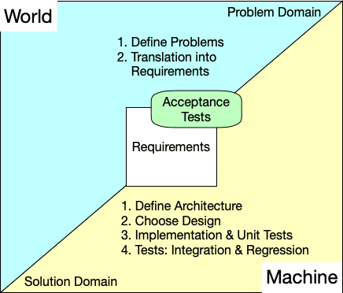
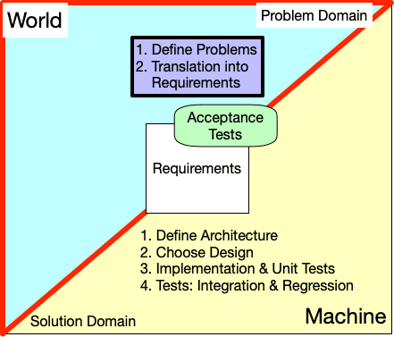
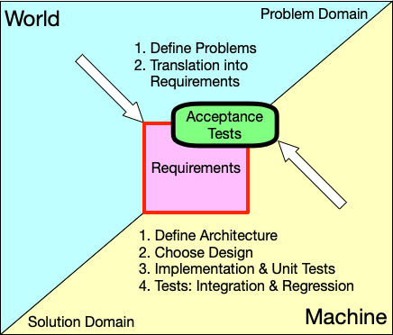
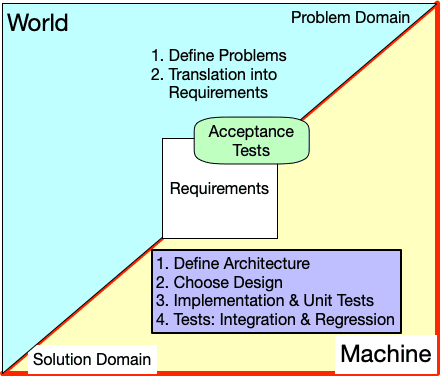
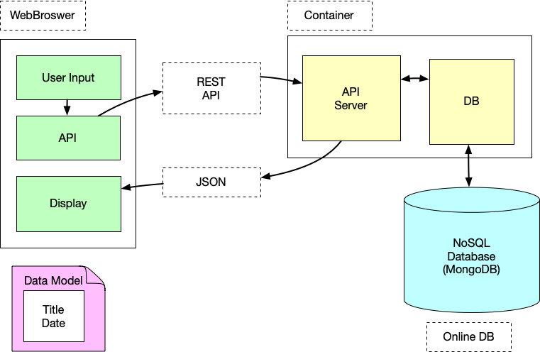
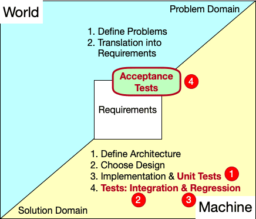

<!-- _class: lead -->
<!-- _class: frontpage -->
<!-- _paginate: skip -->

# Project

Problem Solving in a **Team** or **Individually**

---

## From Problem to Software Solution

### Problem → Requirements → Solution

- **World (Problem Domain)**  
  Understand the real-world problem and its constraints.

- **Requirements**  
  Translate that understanding into clear, testable requirements.

---

### Designing the Machine (Solution Domain)

- **Architecture & Design**  
  Plan how the system will work before writing code.

- **Implementation**  
  Build the system based on the chosen design.

- **Tests & Documentation**  
  Create tests to verify behavior, and document it.

---

### Validation

- **Acceptance Testing**  
  Demonstrate that the built system satisfies all requirements and solves the original problem.

- **Tests**
  Testing is a big part of the project; we need to write unit, integration, and regression tests.

---

### In short, we use **three steps approach**

1. Understand Why & Define Problems
2. Translate the Problems into Features/Requirements
3. Provide High-Quality Solutions



---

<!-- _class: special -->

In this lecture, we use the `TodoApp` as an example for a team project.

- We make the project as small and straightforward as possible; it's a toy-level application to explain the process quickly.
- In the real team or individual projects, students are expected to build much larger and complex applications.

---

## Step 1: Understand Why & Define Problems

The first step is to understand and clearly define the problem we need to solve, and explain why it matters.



---

### Understand Why

Students in ASE courses have multiple assignments and projects with various milestones and deadlines. However, students often:

- Forget about upcoming deadlines
- Start assignments too late
- Struggle to keep track of multiple course schedules

Students need a tool to help them manage their time effectively and avoid missing important deadlines.

---

### Define Problems: What specific problems need to be solved?

**P1: Lack of Proactive Notifications**

- Students do not have a system that proactively notifies them of upcoming course deadlines and milestones

---

**P2: Limited Accessibility**

- Students spend significant time in web browsers for coursework, but lack a browser-based tool to access and manage their course schedules effectively across different devices and locations

---

## Translate the Problems into Features/Requirements

Based on the problem in the **World** (problem domain), we need to develop a feature list.

---

### Features

Features are the problems described in any statement format.

1. This app notifies a deadline of a schedule N days before by sending an email.

2. Students can do the CRUD operation (create, read, update, and delete) about the schedule using the web.

---

### Requirements (User Story Mapping)

We break each feature into multiple **user-story requirements**, each describing:

1. **Who** the user is  
2. **What** they need to do  
3. **Why** they need it  

These user stories then become **acceptance tests**: we verify the feature by acting as the user (who) and checking that the promised behavior (what) is delivered.

---



---

#### Feature 1: This app notifies of a deadline of a schedule N days before by sending an email

- RQ1: **As** a student, I **want to** get a notification email from the app before N days for the schedule S **so that** I do not miss any deadlines.

- RQ2: **As** a student, I **want to** click the checkmark of the schedule S **so that** I can confirm that I am correctly notified and ready to finish the task.

---

We can make RQ1 the `epic requirement` that has sub-requirements.

- RQ1-1: **As** a student, I **want to** specify my email to the system **so that** I can choose the email that the system will use.
- RQ1-2: **As** a student, I **want to** specify the N days to the system **so that** when I can get the email.

For feature 1, we have *three requirements*; and we will have three acceptance tests to prove that these requirements are successfully implemented.

---

#### Feature 2: Students can perform the CRUD operation (create, read, update, and delete) on the schedule using the web

- RQ1: **As** a student, I **want to** make schedule information using HTML form or JSON upload **so that** I can get all the information online.

- RQ2: **As** a student, I **want to** read schedule information in the form of JSON or HTML **so that** I can get all the information online.

---

- RQ3: **As** a student, I **want to** update schedule information using HTML form or JSON upload **so that** I can change any information online.

- RQ4: **As** a student, I **want to** delete schedule information using a HTML form **so that** I can remvoe any information online.

---

We have **two features** and **seven requirements** translated from the two problem definitions.

- We have feature 1 with three requirements.
- We have feature 2 with four requirements.

---

## Provide High-Quality Solutions

### Choosing the **Machine** (Solution Domain)

We know the problem and have translated it into requirements in the User Story format.

- We need to architect and design the Machine (software).
- We need to implement the design
- We need to verify if the architecture and design are properly implemented.

---



---

### Select Architecture

Software Architecture is a high-level design for software.

- It specifies how the information is generated, processed, and consumed at the highest level.
- There are no specific tools for software architecture; we use diagrams and arrows to show the relationship among entities.

---

We select the 3-Tier web application architecture: The client, server, and database.

- By accessing the server with the http protocol, users can use the web app on a web browser.
- The server processes users' input using the REST API.
- The server uses an online database for CRUD operations.



---

### Data Modeling

- Software architecture allows us to see how the information is generated, processed, and consumed.
- In other words, we should define the information that is used throughout the architecture.
- We call this `data modeling`.

---

In the `TodoApp`, we model data as two elements:

1. Title: about the action
2. Data: when the action is done

All the software architecture/design is about making, processing, storing, and deleting this data model.

---

<!-- _class: special -->

Software Design requires a basic understanding of OOP ideas (such as APIEC), principles (such as SOLID), tools (such as UML), and patterns (such as Design and Refactoring Patterns).

- In this course, we define software design as "modules & interfaces".
- So, when we make modules, interfaces to access the modules, and unittests to verify the modules are working fine through the interfaces, we regard that as design software.

---

### Choose Design

Software Design is low-level design for building applications.

- Software design is about modules and interfaces.
- Each module should be verified with a unit test.
- In the design, we identify how the data model is used.

---

#### Front End Design

Software design is mainly about the modules and interfaces of a software component; however, for the front-end, we also need to create a user interface (UI) that is easy to use.

- We have a `views` directory to have all the HTML (GUI) components for the web application.

```txt
─── views
    ├── detail.ejs
    ├── edit.ejs
    ├── list.ejs
    ├── nav.ejs
    └── write.ejs
```

---

#### Utility Functions & Tests

For building applications, we need to create utility functions; creating utility functions is an important part of software design.

- We should make utility modules and interfaces so that other modules can use them.
- For a module, we need to make corresponding unit tests.

```txt
├── tests
│   └── db.util.js
├── util
│   └── util.js
...
```

---

#### Main Modules

We have the main module (index) and API modules (routes and api).

```txt
├── index.js
├── api
│   ├── routes.js
│   └── api.js
```

---

### Related ASE Courses

- ASE 330: Human Computer Interaction
  - This course discusses UX/UI so users can use software effectively.
- ASE 420: Software Design
  - This course focuses on software design, including rules, tools, ideas, and practices
- ASE 456: Cross-platform Development
  - This course focuses on software architecture for building cross-platform applications.

---

### Implementation & Unit Tests

As we have architecture and design, we can implement the design and make tests.

---

#### Choosing the Technology Stack

Once we understand the **why** (problem domain) and the **what** (user stories), finding the **how** is relatively easy.

- Choose the best technology stack for the problem.
- Choose the popular solutions that are easy to understand and use.

---

For our problems & requirements, we use the most popular web technology stack:

- JavaScript as the programming language
- Node.js as the runtime environment
- MongoDB as the database

---

#### Unit Tests

For each module, we should check whether it provides the expected functions.

- It is called unit tests.
- Most programming languages support unit test libraries and tools.

---

### Tests: Integration & Regression

Integration tests verify that two or more modules operate as expected.

- We use the same testing framework as unit tests.

Regression tests ensure that any changes do not break existing code.

- We can build a script to run all the existing tests or automated testing tools.

---

<style>
.columns {
  display: flex;
  gap: 2rem;  
  align-items: center;
}
.column.text {
  flex: 7;
}
.column.image {
  flex: 3;
}
</style>

<div class="columns">
  <div class=" column image">



  </div>

  <div class="column text">
In a project, we need to make at least four tests:

1. **Unit tests**: to verify a single module.
2. **Integration tests**: to verify multiple modules.
3. **Regression tests**: to verify that new changes do not introduce errors.
4. **Acceptance tests**: to verify requirements are met.

  </div>

</div>

---

## Documentation

Documentation is a big part of a software project; without proper documentation, we cannot accumulate our knowledge or experiences.

---

### Answering Questions

Without documentation, we cannot access the project information effectively. We need to make documentation to answer these questions:

1. What's the goal of this project?
2. How is the project going?
3. How is the architecture & design?
4. Where to find the source, tests, and other documents?
4. How to use this software?

---

### Two Types of Documentation

User Manual

- For end users  
- Shows **how to use** the system  
- Steps, screenshots, common tasks, troubleshooting  

Design Documents

- For developers  
- Shows **how the system works**  
- Architecture, APIs, data models, key decisions  

---

### Agile Process and Design Documents

The agile process we use in the class avoids heavy paperwork, but it **does not remove documentation** — it keeps only what delivers value.

- Long documents become outdated fast  
- Requirements change frequently  
- Conversation and prototypes are faster  
- Documentation should support work, not slow it down  

---

#### What Agile Still Documents

Design Documents

- Features
- Requirements
  - User stories (Who / What / Why)
  - Acceptance criteria (Definition of Done)
- High-level architecture
  - Data Model
  - Diagrams

---

- Software Design
  - Directory Structure
  - Detailed Design (After ASE 420 Topics)
- API contracts
  - Examples
  - Edge Cases
  - Inputs/Outputs
- Architecture/Design decisions

---

Agile Process Documents

- Sprint backlog details
- Release notes
- Sprint planning notes
- Stand-up notes
- Burndown charts
- Retrospective notes
- Product backlog
- Issue/bug log

---

#### Tests as Design Documents

Well-written tests become a **living, executable design document**.

- Tests show expected system behavior  
- Each test defines input, action, and outcome  
- Reveal rules, edge cases, and constraints  
- Let developers understand the system quickly  
- Updated tests keep the design description current  

---

## Project Repositories

### GitHub

We use GitHub for project artifacts management:

- Architecture Documents
- Design Documents
- Source Code/Tests
- Any documents for team efforts

---

### Canvas Pages

We use Canvas Page for sharing Team progress:

- Process Documents
- Team Progress Report
- Any documents for the agile process

---

## Portfolio Management

After each project is completed, students should include the project artifacts in their portfolios.

- GitHub.io is often the best for a portfolio
- Many software engineers have their own domain and use it for their portfolio
