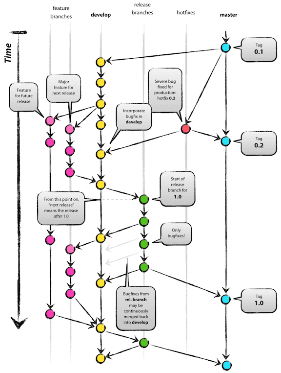

<!-- _class: lead -->
<!-- _class: frontpage -->
<!-- _paginate: skip -->

# What should I do in Git?

---

> I'm in the middle of updates, so I'm not ready to commit; however, I have to update my changes by pulling.
> I don't want to copy all my files somewhere else and copy them back. 
> What should I do?

We can use stash.

---

> I just committed my changes, but I found that I didn't include A. I don't want to make another commit what should I do?

Use the commit amend. However, it changes the history, so if you already pushed your changes to the GitHub. Don't do it.

This is the reason why we need to push to Github until when we are 100% sure. 

---

> I want to do cherry-pick by applying the bug patched commits, but the patch has unnecessary changes also. What should I do.

I don't think cherry-picking is not OK for this case.

This is the reason why we need to make micro and manageable commits.

---

> I don't know how to make good commit comments.
> What should I do?

Make your own convention, but you can use this page <https://gist.github.com/qoomon/5dfcdf8eec66a051ecd85625518cfd13>

---

> I'm concerned about my current git usage: I use only the main branch. Is this OK? 

It depends, but you need a rule for managing branches.

The most widely accepted way is "Git flow".

