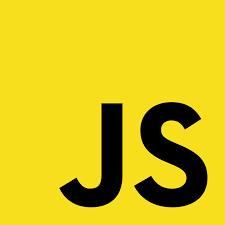
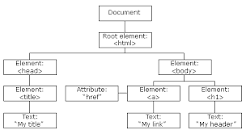
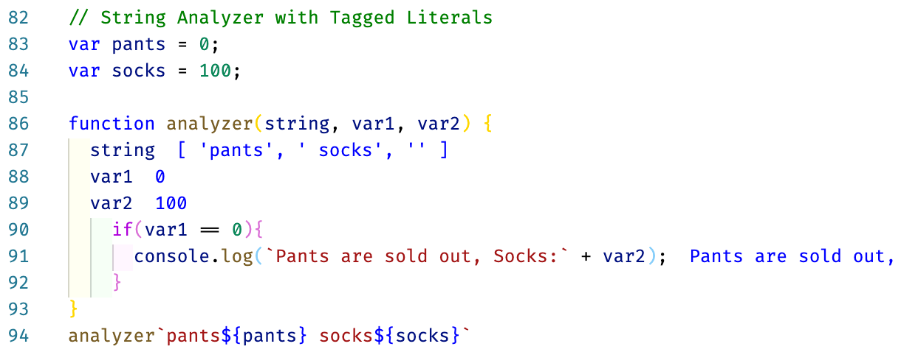

# Software Engineering Programming - JavaScript

**Dr. Samuel Cho, Ph.D.**

NKU ASE/CS

---

# Table of Contents

1. History
2. Functional Programming
3. Const, Var, and Let
4. JSON Object and JavaScript Function
5. Strings
6. Prototype Language
7. OOP Language
8. Interesting features

---

# History

---

## Web 1.0 - Static HTML

- HTML was invented to display Document Object Model (DOM) information on web browsers.
- When web servers get a request from clients (mostly web browsers), they send HTML files as a response (Web 1.0).
- CSS (Cascading Style Sheet) was invented to render HTML elements on a web browser more flexibly.

<div class="columns">
<div>


</div>
<div>


</div>
</div>

---

## Web 2.0 - CGI

- With the invention of CGI (Common Gateway Interface) (Web 2.0), <u>servers</u> can generate HTML DOM dynamically from the request.
- JavaScript was invented to manipulate HTML structure (DOM) on the <u>clients'</u> side.

<div class="columns">
<div>



</div>
<div>



</div>
</div>

---

- With the invention of JavaScript, we can have a dynamic web page (DOM) both from a server-side (CGI) and a client-side (JavaScript).
- This code shows JavaScript code that accesses an element with "one" id, for example, `<h1 id="one">...</h1>`, and displays the content using the alert() method.

```html
<h1 id="one">Hello</h1> <!-- HTML --> 

<script type="text/javascript"> <!-- JavaScript -->
  var text = document.getElementById("one").innerHTML;
  alert(text); <!-- displays Hello -->
</script>
```

---

- JavaScript was not invented as an OOP language but as a Functional Programming/Prototype language.
- It is because JavaScript was invented in 10 days by Brendan Eich for the Netscape web browser.
- He had to make the language as simple as possible, not using the complex OOP model.

<div class="columns">
<div>


</div>
<div>


</div>
</div>

---

- JavaScript models LISP/Scheme (the first functional programming language). So, JavaScript uses functional programming approaches a lot.
- JavaScript also has the Prototype language feature inherited from Self.
- It has no connection with Java, but to enhance sales of JavaScript, they intentionally named it JavaScript.

<div class="columns">
<div>


</div>
<div>


</div>
</div>

---

# Functional Programming

---

## What is Functional Programming (FP)

- In the OOP paradigm, we have two different entities in programming: data (fields) and code (methods).
- We treat data and code differently in OOP, as in this example Dog class.

```javascript
class Dog {
  String name = "Sparky"; // data (fields)
  
  void bark() { // code (methods)
     ... 
  }
}
```

---

- In the FP paradigm, there is no difference between the data and code; in other words, we treat the code as the same as the data.
- We can define a variable (line 1) and a function (line 2), but the function is nothing more than a lambda expression (line 3) as a value (data).

```javascript
val x = 3
add x y = x + y
val add = (x, y) => (x + y)
```

---

- Using this idea, a function can be an argument to other high-level functions.
- In this example, we can give add or sub function as an argument to the `high_lvel_function`.
- This is possible, because code (function) is the same as data (variables) in FP.

```javascript
val add = (x, y) => (x + y)
val sub = (x, y) => (x - y)
val high_level_function = (f, x, y) => f(x, y)
high_level_function(add, 10, 20) // returns 10 + 20
high_level_function(sub, 10, 20) // returns 10 - 20
```

---

## JavaScript and Lisp/Scheme

- JavaScript uses functional programming approaches as it is based on Lisp/Scheme.
- The first method (line 1) is used to define a method in JavaScript.
- However, it is OK to use the FP way to treat a function as a data, like Lisp/Scheme (line 5); we call it lambda (λ) expression (lines 2 -- 3).

```javascript
function add(x,y) {return x + y; }
var add2 = function (x, y){ return x + y; }
var add3 = (x, y) => {return x + y;}

(define (add) (lambda (x y) (+ x y))) ; Scheme code
```

---

- In Lisp/Scheme, functions are the same as data with a type (lines 3 -- 4 for function and line 2 for data).
- So, any function can be used as an argument to any function (line 5).
- In JavaScript, we can now understand why a function can be used as an argument (line 8) to another function (lines 11 -- 12).

```javascript
// scheme
(define x 3)
(define (high_order_function f) ( ;; f is a function
  (apply f '(2 3)))) ; or (f 2 3)
(high_order_function (lambda (x y) (+ x y)))

// JavaScript (f is a function)
function high_order_function(f) {return f(2, 3);}
var r = high_order_function(function (x,y) {return x+y;})
var r = high_order_function((x,y) => {return x+y;})
```

---

- We can understand JavaScript programming better when we are familiar with functional programming styles.
- This is an example of event-driven programming in JavaScript using functional programming.
- It is interesting to notice that Java adopts the functional programming style for its event-driven programming (CSC 360).

```javascript
<p id="hello">Hello</p>
<button id="button">Button</button>

<script>
document.getElementById('button').addEventListener(
  'click', 
  function() { // <- function is given as an argument
   document.getElementById('hello').innerHTML = "Good bye";
  });
</script>
```

---

- There is another example; we also can understand why there are two ways to iterate over an array.
- Non-functional (procedural) way with variables and for loop (lines 1 - 3).
- Functional way to use function (lambda expression) as an argument of a function (lines 5 - 7).
- Java also adopts this functional programming style (CSC 360).

```javascript
var x = [1,2,3,4];
for (var i = 0; i < x.length; i++) {
  console.log(x[i])
}
x.forEach(function(a) { // this is better
  console.log(a)
});
```

---

# Const, Var, and Let

---

## Let, Var, and Const

- JavaScript has two ways to make a variable: let and var.
- The difference between them is that (a) the variables defined with 'let' cannot be redefined, but (b) 'var' variables are OK with the redefine.
- The variables defined with 'const' cannot be modified.

---

- The code shows an example. Line 6 is an error as we try to redefine the variable a that is defined with 'let.'
- It is OK to update the value defined with let as in line 7 or redefine the variable defined with var as in line 8.
- It is not OK to change the constant value as in line 9.

```javascript
if (true) { // to make local variables
  let a = 1; 
  var b = 2;
  const c = 3;
  if (true) { // to make local variables
    var a = 4; // Error as a is let defined
    a = 3; // OK 
    let b = 3;  // OK as b is var defined
    c = 4; //Error 
  }
  console.log(a); 
  console.log(b);
}
```

---

## Why let and var?

- JavaScript was a simple language with only one modifier, 'var.'
- However, var has many issues, including redefinition; especially, var is function scoped, not block scoped, to cause many problems, as the line 7.
- So, JavaScript introduced 'let' to introduce the block scope (CSC 260).

```javascript
function run() {
  {
    var moo = "Mooo"
    let baz = "Bazz";
    console.log(moo, baz); // Mooo Bazz
  }
  console.log(moo); // Mooo <- It's not OK to access moo in the other block
  console.log(baz); // ReferenceError
}
```

---

## Just Use Let

- So, to avoid this confusion, it is recommended to use let variables, which are block scoped.
- Don't use var variables unless you know what you are doing.
- When we define a variable using let, we can't redefine in the same block, but we can do it in a different block; it's similar to Java

```javascript
var x = 10
var x = 20 // You should have a reason to do this
let z = 20
//let z = 40 // Error!
{let z = 40} // This is OK
z = 30
```

---

# JSON Object and JavaScript Function

---

## JavaScript and JSON

- JSON (JavaScript Object Notation) is a representation to express the idea of a dictionary in JavaScript.
- JSON was invented to share information between a web server and a web browser in JavaScript.
- As JavaScript becomes popular, JSON format is used outside JavaScript to make it a language-independent data format.

---

## AJAX

- JavaScript communicates with servers with AJAX (Asynchronous JavaScript and XML), and JSON objects represent the shared information.
- Using AJAX with JavaScript is complicated, so we often use jQuery (line 2).
- This is the code to request a web server with the POST function using JSON object.

```javascript
<script>
  $.ajax({
    method : 'POST',
    url : '/add',
    data : 'study'
  })
</script>
```

---

## JavaScript as Prototype Language

- JavaScript is a Prototype language.
- In the prototype languages, they do not instantiate a new object; instead, they copy an existing object and modify the copied object.
- In this example, the new operator does not instantiate a new Abc but copies the existing Abc object and replaces the name as 'Sam'.

```javascript
function Abc() { // Abc object 
  ... 
}
var a = new Abc('Sam');
```

---

## Function in an Object

- A JSON object can contain anything, including a function.
- We can use the function in an object, notice that lambda expression is used.
- JavaScript can mimic an OOP object with data and function this way.

```javascript
var obj = {
  data: 'Sam',
  add: function(x,y) {return x + y;}
}
console.log(obj.add(10, 20))
```

---

## This in an Object

- When a function has 'this', it means the object that contains the function.
- So, when we access any data in an object, we should prepend 'this.'
- This feature also mimics OOP (CSC 260).

```javascript
var obj = {
  data: 'Sam',
  getData: function() {return this.data;} // returns 'Sam'
  t: function() {return this;}
}

console.log(obj.getData())
// t() returns this object
console.log(obj.t())
```

---

## This Keyword in => Function

- We can use the arrow notation (lambda expression) in an object, but **We should be careful when we use 'this' in an arrow function!**
- JavaScript functions do not return the object when we use 'this' in the function defined with the => notation.
- So, we should use the => notation only when we don't use other data in an object.

```javascript
var obj = {
  data: 'Sam',
  t: function() {return this;},  
  t2: () => {return this;}
}
console.log(obj.t()) // returns JSON object
console.log(obj.t2()) // returns {}
```

---

## Apply

- The apply high-order function applies a function to arguments.
- It is one of the most frequently used in FP.
- As the Lisp/Scheme example shows, when we use apply function, it applies the function hi to the arguments '(1 2 3).
- The result is (+ 1 2 3) == 6.

```javascript
(define (hi x y z) (+ x y z))
(apply hi `(1 2 3)) ; it applies arguments (1 2 3) to the hi
```

---

- JavaScript has the function apply() but uses a somewhat different form.
- Instead of the Lisp/Scheme form 'apply f a', JavaScript uses 'f.apply(a).'
- In this example, we apply the function hello() to an object person2.

```javascript
var person = {
  hello : function(){
    console.log(this.name)
  }
}
var person2 = {
  name : 'Sam'
}
person.hello.apply(person2)
```

---

- If necessary, we can give additional arguments to the function hello.
- In this example, arguments '[1,2,3]' is given to the hello() function.
- Remember that the additional arguments should be in a list, as this idea is borrowed from Lisp/Scheme.

```javascript
var person = {
  hello : function(x, y, z){
    console.log(this.name + ` Hello ${x}-${y}-${z}`)
  }
}
var person2 = {
  name : 'Sam'
}
person.hello.apply(person2, [1,2,3]);
```

---

## Call

- The funcall() function in Lisp/Scheme is similar to the apply() function.
- The only difference is that we give each argument to the function (line 1).
- JavaScript follows the same convention; when we use call() instead of apply(), we should give arguments one by one.

```javascript
(funcall hi 1 2 3) ;; Lisp example
person.hello.call(person2, 1,2,3); // JavaScript
```

---

## The 'this' in JavaScript

- Compared to the **this** in Java that references this object, the **this** in Javascript can refer to different objects depending on where it is invoked.
- This is confusing, and it can be a source of serious bugs. So, we should be careful when we use the **this** in JavaScript.
- This code shows that the **this** returns different objects depending on where it is used.

```javascript
'use strict'
console.log(this) // {Window} <- when invoked in a global context
function a() { 
  console.log(this)
} // undefined <- when invoked in a function
a()
```

---

# Strings

---

## JavaScript String

- Java has a char type (primitive value) and a String (reference type object), and we use `'.'` to represent a character and `''...''` for a Java String (CSC 260).
- JavaScript has only strings, and we use one notation `'...'`, and we can concatenate strings and variables using the '+' operator like Java (line 2).
- We also can interpolate strings (using variables in a string) with `` `...` `` (reverse quotation) and ${...} as in line 3.

```javascript
var cruel = 'cruel';
var line = 'hello ' + cruel + ' world';
var line2 = `hello ${cruel} world`;
```

---

## JavaScript Tagged List

- When the interpolated string is used as an argument to a function, the function can analyze the input to extract values.
- We call this feature 'tagged list.'
- In this example, the analyzer function parses the string argument to retrieve var1 and var2.

```javascript
var pants = 0; var socks = 100
function analyzer(string, var1, var2) {
    if(var1 == 0){
      console.log(`Pants are sold out, Socks:` + var2);
    }
}
analyzer`pants${pants} socks${socks}`
```

---

- Notice that this code is output from Quokka extension.
- It displays parsed input results in lines 87 - 89.
- In other words, the values in any interpolated string can be retrieved using this method.



---

# Prototype Language

---

## Old Way to Make Objects

- JavaScript is a prototype-based language, not an OOP language.
- This means that when we have a prototype object, we can copy it to make another object.
- To do this, we need **a function that contains members (elements with the this)** (lines 1 - 3).

```javascript
function Machine(){
  this.name = 'Sam'; // Don't forget this
}
```

---

- It is important to notice that the prototype function's variables must have the 'this.' keyword prepended.
- Also, we need to follow the convention that the prototype function name starts with a capital letter.
- Then, we can use the new operator to make an object from a prototype function.

```javascript
function Machine(){ // prototype function
  this.name = 'Sam'; // Don't forget 'this'
}

var person1 = new Machine(); // {name: 'Sam'}
var person2 = new Machine(); // {name: 'Sam'}
```

---

- We can add new functions in the prototype function.
- We can call the functions in the objects (lines 9 - 10).

```javascript
function Machine2(){
  this.name = 'Sam';
  this.hello = function() {
    console.log('Hello ' + this.name)
  }
}
var person1 = new Machine2(); 
var person2 = new Machine2(); 
person1.hello() // 'Hello Sam'
person2.hello() // 'Hello Sam'
```

---

## Constructor

- When we want to change the variable name, we can give **an argument** to the prototype function (lines 7 -- 8).
- We call this function constructor because it does the same thing as Java Constructor (CSC 260).

```javascript
function Machine3(name){ // constructor with an argument
  this.name = name;
  this.hello = function() {
    console.log('Hello ' + this.name)
  }
}
var person1 = new Machine3('Sam');
var person2 = new Machine3('John);
person1.hello() // 'Hello Sam'
person2.hello() // 'Hello John'
```

---

## Inheritance Using Prototype

- Any (prototype) objects have the 'prototype' property.
- When we need to extend prototype functions, we can add new features to the prototype using the 'prototype' property.
- As an example, this code shows how we can add the 'id' variable to the Machine3 function using the prototype property.

```javascript
Machine3.prototype.id = 'chos5'; // extends the machine3
```

---

- We have a constructor function (line 1) that uses a prototype to add the id variable (line 2).
- We make an object using a constructor function, and we see that the 'id' is not a part of the object (lines 3 -- 4).
- When JavaScript accesses person1.id, it searches the id in a current (person1) object, as it cannot find the person1.id, it searches the parent's prototype variables to find the id variable in the prototype property. (line 4).

```javascript
function Machine3(name) { ... }
Machine3.prototype.id = 'chos5';
var person1 = new Machine3('Sam');
console.log(person1) // Machine3 { name: 'Sam', hello: ... }
console.log(person1.id) // chos5
```

---

## Example of Prototype - toString()

- We can use [...] notation to make an array object.
- However, it is the simplified syntax of 'new Array(...).'
- We can use the toString() function as it is a member of the Array constructor function.

```javascript
var arr = [1,2,3]; // simplified syntax (constructor is hidden)
var arr = new Array(1,2,3);
console.log(arr.toString()); // We can use toString()
```

---

- We can use the 'Array.prototype' to check the available functions; also, we can use 'arr.__proto__' to get the same information.
- We may need to use Chrome's Developer feature to get the full list, as Node.js may show no information such as Object(0) or [].

```javascript
console.log(Array.prototype); // to get parent's prototype (Object(0))
console.log(arr.__proto__); // Object(0)
```

---

## Dynamic Object Extension

- In this example, we make the p object (line 1) to be the prototype of an empty object (line 3).
- In this case, even though the object 'c' looks empty with nothing in it (line 4), c can access all the object elements of p (line 5).

```javascript
var p = {name: 'Sam'};
var c = {}
c.__proto__ = p
console.log(c) // {}
console.log(c.name) // 'Sam'
```

---

## ES5 Features

- JavaScript ES5 is the first major revision of JavaScript.
- JavaScript ES5 adds a new function Object.create().
- We can use Object.create() to make an object, and the copied object's prototype has the p (line 2).
- So, when we print c, we get an empty object, but we can access the p.id variable through the prototype.

```javascript
var p = {name: 'Sam', id:'chos5'}
var c = Object.create(p)
console.log(c) // {}
console.log(c.id) // c can access id
```

---

- Let's add a new variable id in the c object (line 1).
- In this case, the id is a member of the object c (line 2).
- The id in its prototype is overridden, as the c.id will be accessed, not the p.id, when we access the variable id.

```javascript
c.id = 'chos6' // we create a new id
console.log(c) // {id: 'chos6'} prototype id is hidden
console.log(c.id) // chos6 is printed
```

---

# OOP Language

---

## ES6 Class Feature

- JavaScript ES6 is the version that actively adopts OOP ideas.
- In ES6, JavaScript introduces the 'class' concept to support the OOP paradigm.
- However, behind the scene, it is syntactic sugar, meaning that it mimics OOP programming methodology, not that ES6 is an OOP language.

---

- This example shows how we can use 'class' to incorporate the constructor function.

```javascript
// ES5 or before
function Machine3(name){
  this.name = name;
  this.hello = function() {
    return('Hello ' + this.name)
  }
}
// ES6
class Machine4 {
  constructor(name) {
    this.name = name
    this.hello = function() {
      return('Hello ' + this.name)
    }
  }
}
```

---

When we need to add more prototype functions, we have two approaches.

- The first approach is to use a prototype to add a new function (lines 1 - 4).
- The second approach is to make the prototype function in the class (lines 14 - 16).

```javascript
// Adding a function to prototype - method 1
Machine4.prototype.hello2 = function() {
  return('Hello2 ' + this.name)
}

// Adding a function to prototype - method 2
class Machine5 {
  constructor(name) {
    this.name = name
    this.hello = function() {
      return('Hello ' + this.name)
    }
  }
  hello2() { // added to prototype
    return('Hello2 ' + this.name)
  }
}
```

---

- We can make an object (line 1).
- In this example, person1 is an object from the class NewMachine5, so it has all the functions and variables in the constructor.
- However, even though it does not have hello2() function, it can access and use it (line 3).

```javascript
var person1 = new NewMachine5('Sam','GH565');
console.log(person1); // Machine5 { name: 'Sam', hello: ...}
console.log(person1.hello2()) // Hello2 Sam
```

---

## Getter and Setter

- In CSC 260, we learned the OOP idea, encapsulation, to hide data from direct access.
- From this idea, we can make the function setAge() to access and modify the variable (data) in an object.

```javascript
var person = {
  name: 'Sam',
  age: 10,
  setAge(age) {
    this.age = parseInt(age); // if age is string type value
  }
}
person.setAge(15)
console.log(person)
```

---

- With JavaScript, we can use the set/get modifier keyword to make the functions, setAge/nextAge, properties.
- Properties are functions that can be used as if they are variables.

```javascript
var person = {
  name: 'Sam',
  age: 10,
  set setAge(age) { // set makes setAge function a setAge property
    this.age = parseInt(age); // if age is string type value
  },
  get nextAge() {
    return this.age + 1
  }
}
person.setAge = 20 // setAge becomes a property
console.log(person.nextAge)
console.log(person)
```

---

# Interesting features

---

## Spread Operator

- We can use an array to aggregate multiple values (lines 1 -- 2).
- When we use an array with '...' prepended, we call the '...' a spread operator.
- The spread operator spreads out each element of an array as function arguments (lines 3 -- 4).

```javascript
var array = ['hello', 'world'];
console.log(array);    // ['hello', 'world']
console.log(...array); // hello world
console.log(array[0], array[1]) // same as ...arrary
```

---

- Let's say we have a function hello() that requires two arguments.
- When we don't use the spread operator, we should extract the two elements in an array as in line 7.
- But we don't have to do it with the spread operator that does the work for us.

```javascript
var array = ['hello', 'world'];

function hello(x, y) {
  console.log(x);
  console.log(y);
}
hello(array[0], array[1]); // ugly
hello(...array); // better
```

---

- We can use the spread operator to concatenate arrays into one.
- As the code shows, we can spread two arrays into a new array.

```javascript
var a = [1,2,3];
var b = [4,5];
var c = [...a, ...b]; // [1,2,3,4,5]
```

---

## Spread Operator for an Object

- We can use the spread operator for an object.
- This example shows how we can copy all the elements in an object o1 into o2 with a new element added.

```javascript
var o1 = { a : 1, b : 2 };
var o2 = { c : 3, ...o1 };
console.log(o2); // { c: 3, a: 1, b: 2 }
```

---

## Deep Copy and Shallow Copy

- The spread operator is used for deep copy.
- When we copy arrays, we sometimes make a mistake copying only a reference; we call it a shallow copy (lines 1 - 3).
- To avoid this, we should copy all the elements; we call it a deep copy (lines 5 - 7).

```javascript
var a = [1,2,3];
var b = a; // shallow copy, a and b reference the same array.
b[0] = 1000; console.log(a[0] == b[0]); // true

var a = [1,2,3]
var b = [...a]
b[0] = 2000; console.log(b[0] != a[2])
```

---

## Rest Parameter

- The spread operator can be used as a function parameter when we don't know the number of arguments given (lines 1 -- 4).
- When we select only some of the arguments, we can use the normal parameter and the spread parameters to select only the arguments into an array (lines 5 -- 7).

```javascript
function f(...params){
  console.log(params); 
}
f(1,2,3,4,5,6,7); // [1,2,3,4,5,6,7]
function f2(a,b, ...params){
  console.log(params); 
}
f2(1,2,3,4,5,6,7); // [3,4,5,6,7]
```

---

## Sameness Check in JavaScript

- You may remember that in Java, we use '==' operator for primitive type values, and equals() method to compare objects (CSC 260).
- JavaScript uses '==' operator when we compare two values ignoring data type.
- So, as long as values represent the same number, such as 1, 1.0, or even '1'. They are the same with the '==' operator.

```javascript
console.log(1 == '1') // true
console.log(1 == 1.0) // true
```

---

- So, when we compare two values and when we need to check the data type also, we should use the '===' or '!==' operator.
- In this example, line 1 returns false.
- However, line 2 returns true because there is no integer type in JavaScript; all the numbers are floating-point numbers.

```javascript
console.log(1 !== '1') // false
console.log(1 !== 1.0) // true
```

---

- We should also remember that the number 1 and true are the same with the '==' operator but not with the '===' operator.
- Also, 0 and false are the same with '==' operator, but false with '===' operator.

```javascript
console.log(1 == true) // true
console.log(1 === true) // false

console.log(0 == false) // true
console.log(0 === false) // false
```

---

## Object comparison

- We discussed the difference between shallow copy (reference copy) and deep copy.
- In this example, the two different objects comparison with '==' and '===' operators return false.
- It is because a and b store each object's reference (address).

```javascript
var a = { name : 'Sam' };
var b = {...a};

console.log(a == b)  // false
console.log(a === b) // false
```

---

- To check shallow equality, we can use both '==' and '===' operators.

```javascript
var a = { name : 'Sam' };
var b = a

console.log(a == b)
console.log(a === b)
```

---

- To check deep equality, we need to compare if the two objects have the same values recursively.

```javascript
function deepEqual(object1, object2) {
  const keys1 = Object.keys(object1);
  const keys2 = Object.keys(object2);
  if (keys1.length !== keys2.length) {
    return false;
  }
  for (const key of keys1) {
    const val1 = object1[key];
    const val2 = object2[key];
    const areObjects = isObject(val1) && isObject(val2);
    if (
      areObjects && !deepEqual(val1, val2) ||
      !areObjects && val1 !== val2
    ) {
      return false;
    }
  }
  return true;
}
function isObject(object) {
  return object != null && typeof object === 'object';
}
```

---

## null and undefined Comparison

- In JavaScript, null and undefined are different.
- 'null' is a value, so it can be defined to some variables (line 1).
- However, 'undefined' means a variable is not defined. So, it's indication not a value.

```javascript
var x = null; 
console.log(x) // null
var y; // y is not defined
console.log(y) // undefined
```

---

- When we use '==' to compare 'null' and 'undefined', it returns true.
- We can understand it, as '==' just compares if the two inputs are equivalent; like 1 and '1'.
- As we can expect, the '===' returns false when we compare 'null' and 'undefined.'

```javascript
console.log(null == undefined) // true
console.log(null === undefined) // false
```
