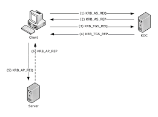
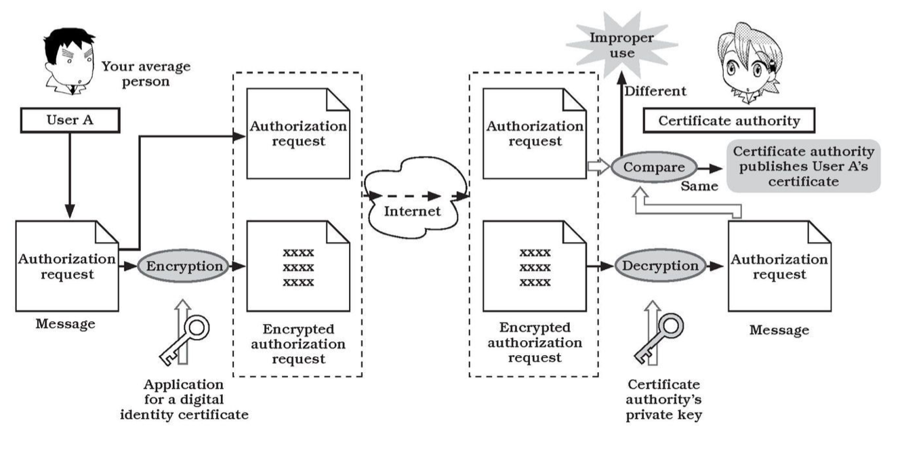
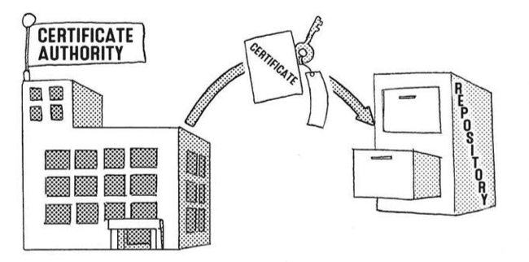
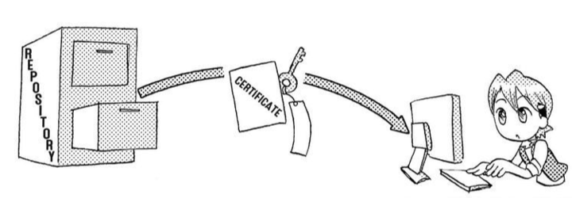
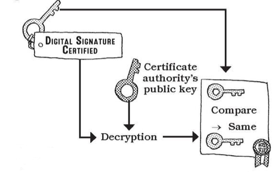

# Software Engineering Tools - Information Security

**Dr. Samuel Cho, Ph.D.**

NKU ASE/CS

---

# Table of Contents

1. Information Security Fundamentals
2. Symmetric Encryption
3. Hash, Salt, and HMAC
4. Asymmetric Encryption (RSA)
5. Digital Signing
6. Hybrid Encryption
7. PKI and Certificate Authority
8. Real-World Applications
9. File I/O for Security

---

# Information Security Fundamentals

---

## Information Security

- We are living in an information age. Any information is digitized, stored, and shared.
- Digitized information is easy to leak, hack or modify.
- So, there are many tools and rules for secure information.
- As software engineers, we should understand information security to make the software products that secure information that they process.

---

## CIA Triad

- We have a principle in information security called the CIA Triad.
- The CIA triad stands for <u>C</u>onfidentiality, <u>I</u>ntegrity, and <u>A</u>vailability.
- As software engineers, we should strive for a good balance among the elements that constitute the CIA principle.


---

<div class="columns">
<div>

- **Confidentiality** makes sure that only authorized personnel are given access or permission to modify data
- **Integrity** helps maintain the trustworthiness of data by having it in the correct state and immune to any improper modifications
- **Availability** means that the authorized users should be able to access data whenever required

</div>
<div>


</div>
</div>

---

<div class="columns">
<div>

- The ATM and bank software ensure data integrity by maintaining all transfer and withdrawal records made via the ATM in the user's bank accounting.
- It keeps the confidentiality by allowing only people with password or similar security devices can access the software.
- It tries to enhance availability by allowing the authorized persons can access the features that the software provides.

</div>
<div>


</div>
</div>

---

<div class="columns">
<div>

- In other words, the CIA Triad works as a set of information security rules that we should follow when we develop software.
- For the rest of this chapter, we discuss the tools for information security.

</div>
<div>


</div>
</div>

---

# Symmetric Encryption

---

## Symmetric Encryption

- Encryption is the process of making a message confidential (like a hash) while allowing it to be reversible (decrypted) with the proper key.
- In symmetric encryption, the same key is used to encrypt and decrypt the message.


---

## Node.js module

- We use the 'crypto' module to use JavaScript decrypt and encrypt functions.
- Each time a message is encrypted, it is randomized to produce a different output. So, we should also use the random function.

```javascript
const { createCipheriv, randomBytes, createDecipheriv } = require('crypto');

/// Cipher
const message = 'I like ASE 285 students!';
```

---

- The first step is to create a key and an initialization vector (iv) as in lines 2 -- 3. This information becomes the key that is shared.
- The next step is to create a cipher object as in line 5.

```javascript
// these key/iv should be shared. 
const key = randomBytes(32); const iv = randomBytes(16);
const infoToShare = {key:key.toString('hex'), iv:iv.toString('hex')}

const cipher = createCipheriv('aes256', key, iv);
```

---

## Encryption Code

- We can use the cipher object to encrypt the message.
- We should add the final code to make it harder to decrypt.

```javascript
const encryptedMessage = cipher.update(message, 'utf8', 'hex') + cipher.final('hex');
```

---

## Decryption Code

- Once we have the shared key and iv, we can decrypt the message.

```javascript
const key2 = Buffer.from(infoToShare.key, 'hex')
const iv2 = Buffer.from(infoToShare.iv, 'hex')
const decipher = createDecipheriv('aes256', key2, iv2);
const decryptedMessage = decipher.update(encryptedMessage, 'hex', 'utf-8') + decipher.final('utf8');
```

---

## AES 256 Algorithm

- In the examples, we have used AES (Advanced Encryption Standard) 256 algorithm to encrypt information.
- This is a standard published and maintained by the NIST.
- We should never come up with our own hidden encryption/decryption algorithms, but we should use the standard algorithms such as AES 256.

---

- It is a well-known fact that the AES algorithm cannot yet be cracked, at least not in this lifetime.
- It would take billions of years for a supercomputer to crack even a 128-bit AES key.
- Quantum computers can break AES algorithms quicker, but, according to some sources, it would still take a quantum computer roughly six months to exhaust the possibilities of a 128-bit AES key.
- So, we can say that it is safe to use AES 256 in our applications.

---

## Can we ...

- Can we share keys without exchanging the keys?
- As exchanging keys might impact security, people have thought about sharing keys without exchanging them.
- DH Key Exchange Algorithm is the most widely used method to share keys without actually exchanging them.

---

## DH (Diffie-Hellman) Key Exchange

<div class="columns">
<div>

- DH (Diffie-Hellman) is a method of securely exchanging cryptographic keys over a public channel.
- Alice and Bob has random integer a and b that they do not share, but they can create A = g^a mod p and share p, g, and A with Bob.
- Then Bob creates B = g^b mod p to send B to Alice.

</div>
<div>


</div>
</div>

---

- Hackers can steal p, g, A, B, but not a (private only to Alice) and b (private only to Bob).
- Both Bob and Alice can generate a key g^ab mod p from (g^a)^b mod p = (g^b)^a mod p = g^ab mod p, but not the hacker because the hacker cannot make g^ab mod p from p, g, A, B.
- So both Bob and Alice can share the key with this simple integer arithmetic.

---

# Hash, Salt, and HMAC

---

## Q & A

- Q: I am not sure if my file is modified or not. How can I check that?
- A: We need a hash, salt, or HMAC to find if some files are modified or not effectively.
- Q: Is that the same hash we used in git?
- A: Yes, it is. That's how git identifies if something is changed or not.

---

## Hash

- Hash means 'chop and mix,' and that describes what a hashing function does.
- Hashing algorithms, like SHA (Secure Hashing Algorithm), produce a random, unique, fixed-length string from a given input.
- They are often used to compare two values, like passwords, for equality because the same input will always produce the same output.


---

- We can extract fingerprint using the hash and share it.
- The shared hash will be compared to detect a possible tampering.


---

## Code Using Hash

- There are many algorithms available for hashing functions, but we use SHA256 in this example.
- We should not use MD5 as it is not safe anymore.

```javascript
const {creatHash, createHash} = require('crypto')
function hash(input) {
    return createHash('sha256').update(input).digest('hex');
}

let password = 'hello';
const hash1 = hash(password); console.log(hash1)
const hash2 = hash(password); console.log(hash2)
const hash3 = hash(password + "2"); console.log(hash3)

console.log(hash1 == hash2) // true
console.log(hash2 == hash3) // false
```

---

## Salt

- Hashes are great for making passwords unreadable, but because they always produce the same output, they are not very secure.
- A salt is a random string that is added to the input before hashing.
- This makes the salt more unique and harder to guess.


---

## Code Using Salt

- This is the function signup() to return a password with both salt and hashed password.
- The function scryptSync() is the method that uses password and salt to return an object, so we should use toString('hex') to make a readable string (line 4).
- We store the password that has the format of 'salt:password' (line 5).

```javascript
const users = [];
function signup(email, password) {
  const salt = randomBytes(16).toString('hex');     
  const hashedPassword = scryptSync(password, salt, 64).toString('hex');
  const user = { email: `${email}`, password: `${salt}:${hashedPassword}` } 
  users.push(user);
  return user
}
```

---

- This is a login function with an email address and password.
- This function returns true or false depending on the authentication results.

```javascript
// const users = [];
function login(email, password) {
    const user = users.find(v => v.email === email);
    const [salt, pw] = user.password.split(':');
    // Make the hashedBuffer (not a hex string) because we need a buffer to use timingSafeEqual
    const created_pw = scryptSync(password, salt, 64).toString('hex')// use the salt to make hash from the given password
    return created_pw === pw; 
}
```

---

## HMAC

- HMAC (Hash-based Message Authentication Code) is a keyed hash of data - like a hash with a password.
- HMAC is also called as MAC.
- Using a different key produces a different output.


---

- Both Hash and Salt focuses only on integrity.
- To create an HMAC, you need to have the key, therefore allowing you to verify both the authenticity and integrity (originator of the data).
- In other words, we can use HMAC to check if the message is compromised or not, as those who have the password can make the same HMAC from the message.

---

- To use HMAC, a key should be shared in advance.
- HMAC gives one more layer of security to prevent the possible tampering of both message and hash.


---

## Code Using HMAC

- In this example, we send a message with HMAC. A sender and a receiver share the password.
- Let's say we send a message and HMAC.

```javascript
const { createHmac } = require('crypto');

const password = 'hello!';
const message = 'hello world'

// We need to generate the same hash only when we know the password
// Server can be sure the hmac hash is correct only when the sender has the correct password 
const hmac = createHmac('sha256', password).update(message).digest('hex');
// We can send message and password
```

---

- The receiver already has a shared key, so the receiver can generate the HMAC from the key and a message.
- The receiver can compare the received HMAC and generated HMAC to check if the message is compromised or not (integrity check).

```javascript
// message and hmac are received
const hmac_created = createHmac('sha256', password).update(message).digest('hex');

if (hmac_created === hmac) {
    console.log(`${message} is not compromised.`)
}
else {
    console.log(`${message} is compromised.`)
}
```

---

# Asymmetric Encryption (RSA)

---

## The Problems of Symmetric Encryption

- We should share keys to use symmetric encryption.
- What if we should share keys with millions of people?
- We can easily guess that it is likely that hackers can get the key that many people share.

---

## The Solution

- Then, how about the idea of sharing not the key, but the lock?
- If we can make the locks available to everybody, anyone who wants to share secret information can use the lock to encrypt it before they send me the information.
- As I do not share the keys, I am the only person who can decrypt the secret information (unlock the lock).


---

- This algorithm, called the RSA algorithm, is a revolutionary idea that changed the encryption/decryption system.
- In RSA, we call the lock a public-key and the key private-key.
- The acronym "RSA" comes from the surnames of Ron Rivest, Adi Shamir, and Leonard Adleman, who publicly described the algorithm in 1977. They got the Turing award in 2002.
- This RSA algorithm (or public key algorithm) is used practically widely when sharing information on the Internet.

---

## Q & A

- Q: When I used GitHub, I had to generate some keys using the program ssh-keygen and upload it on GitHub. Is it the public key that I uploaded?
- A: Yes. You uploaded the public key (lock) on GitHub so that when GitHub needs to send you information, it uses the public key (lock) to secure the information. As you only have the matching private key (key), you alone can decrypt the information.

---

## keypair.js Module

- We need to generate a public and private key pair in the keypair.js module.

```javascript
export {privateKey, publicKey}
const { generateKeyPairSync } = require('crypto');

const { privateKey, publicKey } = generateKeyPairSync('rsa', {
  modulusLength: 2048, // the length of your key in bits
  publicKeyEncoding: {
    type: 'spki', // recommended to be 'spki' by the Node.js docs
    format: 'pem',
  },
  privateKeyEncoding: {
    type: 'pkcs8', // recommended to be 'pkcs8' by the Node.js docs
    format: 'pem',
  },
});
```

---

## Encryption

- Then, using the public and private key, we can encrypt any information.

```javascript
const {  publicEncrypt, privateDecrypt } = require('crypto');
const { publicKey, privateKey } = require('./keypair');

const secretMessage = 'ASE 285 students are superb!'
const encryptedData = publicEncrypt(
    publicKey,
    Buffer.from(secretMessage)
  );
console.log(encryptedData.toString('hex'))
```

---

## Decryption

- We can decrypt the information using the private key.

```javascript
const { publicEncrypt, privateDecrypt } = require('crypto');
const { publicKey, privateKey } = require('./keypair');

const decryptedData = privateDecrypt(
    privateKey,
    encryptedData
);

console.log(decryptedData.toString('utf-8'));
```

---

# Digital Signing

---

## Repudiation

- Repudiation is the ability to deny being the sender of a message.
- For example, a message and HMAC value are sent from A to B, and afterward A claims, "I didn't send this message to B. B made this up."
- We need Digital Signature (or Signing) to solve this problem.
- Notice that HMAC uses the shared key to enable possible repudiation.

---

- Signing is the process of creating a digital signature of a message.
- A signature is a hash of the original message, which is then encrypted with the sender's private key (not the shared key as in HMAC).
- The signature can be verified by the recipient using the public key of the sender.
- This can guarantee the original message is authentic and unmodified.


---

- Remember that the digital signature is nothing more than an encrypted hash with a sender's private key.


---

## Creating a Signature

- We need to check the integrity of the data.
- So, we create a signature from a private key (line 8) and a sign that contains the original data (line 7).

```javascript
const { createSign, createVerify } = require('crypto');
const { publicKey, privateKey } = require('./keypair');

const data = 'I need to sign this document.';
/// SIGN
const signer = createSign('rsa-sha256');
signer.update(data);
const siguature = signer.sign(privateKey, 'hex');
```

---

## Verifying the Signature

- When we receive the data and signature, we can create a verifier (line 1) with data (line2) to verify the results (line 3).

```javascript
verifier = createVerify('rsa-sha256');
verifier.update(data);
const isVerified2 = verifier.verify(publicKey, siguature, 'hex');
console.log(isVerified2);
```

---

# Hybrid Encryption

---

## The Challenge

- The calculations for symmetric-key algorithms are fast, but exchanging keys is an issue.
- The calculations involved in public-key cryptography take a lot of time, but exchanging keys to implement a public key scheme is simple.
- How can we solve this problem?
- **Hybrid Encryption.**

---

## Solution

- We encrypt and share the shared key (symmetric-key) using the public-key before we start communication.
- Once we share the shared key, we can communicate securely using the shared key.


---

# PKI and Certificate Authority

---

## PKI

- Just as social infrastructure maintains the security and authenticity of money, public-key infrastructure (PKI) guarantees information security and authenticity for public-key encryption.
- In other words, because of PKI, we can use public-key encryption to exchange emails, do business over the internet, and perform other actions with peace of mind.
- The KDC (Key Distribution Center) is an example of PKI.

---

- Anyone can register public keys in KDC, or KDC can create public keys whenever necessary.
- In this example, user A register his public key and get a certificate.
- When user B needs a user A's public key, she can access KDC to get A's authenticated public keys.


---

- Using his own private key, User A attaches a digital signature he has generated to the message. Then he sends the message to User B.
- Using user A's public key, User B verifies the digital signature on the received message. If the decryption of the digital signature with User A's public key matches the message sent, the message is legitimate.

<div class="columns">
<div>


</div>

→

<div>


</div>
</div>

---

## Kerberos KDC Protocol

- Kerberos is the most widely used KDC protocol.
- When we need to provide KDC service, we need to install Kerberos server.

<div class="columns">
<div>



</div>
<div>


</div>
</div>

---

## The Trusted Certificate Authority (CA)

- How do we know this public key belongs to user A?
- So, we need the trusted CA.
- CA certifies and publishes user A's request.
- In this case, user A requests A's public key authorization.

---

## CA Certifies A's Request

- When the decryption of the received application and the public key are verified, the certificate authority will grant user A the certificate.



---

## CA, Users A and B to share the Public key

- User A registers their public key with the CA, which publishes a certificate.
- The certificate is encrypted with the CA's private key, so we need CA's public key to encrypt the certificate.

<div class="columns">
<div>


</div>
<div>



</div>
</div>

---

- User B downloads User A's certificate from the repository.

<div class="columns">
<div>


</div>
<div>



</div>
</div>

---

- User B decrypts user A's certificate using the CA's public key.
- User B now has a public key in the certificate and another public key that is certified by CA.
- User B then compares the public key and digital signature key.
- If the two keys are the same, User B has verified that the message came from User A.



---

## Automatization of the CA related Process

<div class="columns">
<div>

- In practice, all of the validation and authentication process is automatically processed by software tools.
- Web browsers, private software registration cards, and card readers, all have the information about the CAs to automatize the whole process.

</div>
<div>


</div>
</div>

---

# Real-World Applications

---

## Overview

- As we learned the basics of information security, we can understand the applications that use the security tools.

---

## Password Storage

<div class="columns">
<div>

- Servers do not store password in its original form.
- Instead, they create a hash and salt values from the password, and store them.
- Therefore, even when the password files are hacked, hackers need to decrypt the original passwords from the hash values.

</div>
<div>


</div>
</div>

---

## SSL

- SSL uses the hybrid encryption
- SSL certificates create a foundation of trust by establishing a secure connection.
- SSL aims to share a session key (symmetric/shared) securely between a browser and a web server. SSL uses a public key to share the session key.
- The shared session key is used for all communications between the browser and the server.

---

## How SSL Works?

1. Browser connects to a web server (website) secured with SSL (HTTPS). Browser requests that the server identify itself.
2. Server sends a copy of its SSL Certificate, including the server's public key and a message.


---

3. Browser checks the certificate root against a list of trusted CAs and that the certificate is unexpired, unrevoked, and that its common name is valid for the website that it is connecting to.
4. If the browser trusts the certificate, it creates, encrypts, and sends back a symmetric session key using the server's public key. Notice that the browser (client) and server uses hybrid encryption now.


---

5. Server decrypts the symmetric session key using its private key and sends back an acknowledgment encrypted with the session key to start the encrypted session.
6. Server and Browser now encrypt all transmitted data with the session key.


---

## TLS

- Transport Layer Security (TLS) is the successor protocol to SSL. TLS is an improved version of SSL.
- It works in much the same way as the SSL, using encryption to protect the transfer of data and information.
- The two terms are often used interchangeably in the industry, although SSL is still widely used.

---

## HTTPS

- Hypertext Transfer Protocol Secure (HTTPS) is an extension of the Hypertext Transfer Protocol (HTTP).
- It is used for secure communication over a computer network and is widely used on the Internet.
- In HTTPS, the communication protocol is encrypted using Transport Layer Security (TLS) or, formerly, Secure Sockets Layer (SSL).
- The protocol is therefore also referred to as HTTP over TLS or HTTP over SSL.

---

## SSH

- The Secure Shell Protocol (SSH) is a cryptographic network protocol for operating network services securely over an unsecured network.
- SSH operates on TCP port 22 by default (though this can be changed if needed).
- The host (server) listens on port 22 (or any other SSH assigned port) for incoming connections.
- It organizes the secure connection by authenticating the client and opening the correct shell environment if the verification is successful.

---

## How Does SSH Work?

- When a client tries to connect to the server via TCP, the server presents the encryption protocols and respective versions that it supports.
- If the client has a similar matching pair of a protocol and version, an agreement is reached, and the connection is started with the accepted protocol.

---

- The server also uses an asymmetric public key which the client can use to verify the authenticity of the host.
- This is why the SSH client stores the public keys in `~/.ssh/` for the verification.
- Once this is established, the two parties use what is known as a Diffie-Hellman Key Exchange Algorithm to create a symmetrical key.

---

## SSH Authentication Using Password

- For authenticating users, most SSH users use a password.
- The user is asked to enter the username, followed by the password.
- These credentials securely pass through the symmetrically encrypted tunnel, so there is no chance of them being captured by a third party.

---

## Better Authentication Using Public Key

- We can generate and use SSH keys to enable simple and secure user authentication.
- We use 'ssh-keygen -t rsa' to generate a pair of keys on the local machine.
- The generated public key should be copied to the server using 'ssh-copy-id user@serverip.'
- Then, we can log in to the remote server using ssh without giving the password.

---

## PGP

- Pretty Good Privacy (PGP) is an encryption program that provides cryptographic privacy and authentication for data communication.
- We have used JavaScript packages for information security.
- We also can use PGP tools for protecting digital information.
- We can use PGP as a library to be used for other programming languages - https://www.openpgp.org/software/developer/.

---

## GPG Installation

- GPG (GNU PGP) is the Open source implementation of PGP.
- We can install PGP CLI programs using 'brew' or 'choco.'
- Use the name 'gnupg' for its installation. When installed, the 'gpg' is the command.

```bash
brew install gnupg # Mac
choco install gnupg # PC
gnupg ... # need more arguments
```

---

## Create a public/private key pair

- `gpg --gen-key` is the command to make the key pair.
- Give your information with a paraphrase. I assume Sam (smcho) makes the key.
- Then, a gpg directory is created to store the keys.

```bash
gpg: /Users/smcho/.gnupg/trustdb.gpg: trustdb created
gpg: directory '/Users/smcho/.gnupg/openpgp-revocs.d' created
gpg: revocation certificate stored as '/Users/smcho/.gnupg/openpgp-revocs.d/F57AC82C7287D917A00C52AD951B59471C7CF6FE.rev'
public and secret key created and signed.

pub   ed25519 2022-03-15 [SC] [expires: 2024-03-14]
      F57AC82C7287D917A00C52AD951B59471C7CF6FE
uid                      smcho <chos5@nku.edu>
sub   cv25519 2022-03-15 [E] [expires: 2024-03-14]
```

---

## Make a Public Key

- Use http://irtfweb.ifa.hawaii.edu/~lockhart/gpg/ as a reference.
- Run `gpg --export -a "smcho" > public.key` to make a public key to share.
- Students should use the correct user name when they used 'pgp --gen-key' not "smcho".
- Sam (smcho) can share the public.key to anyone.

---

## Importing a Shared Public Key

- Let's say Jim wants to send Sam (smcho) an encrypted file.
- Jim receives Sam's public key (public.key).
- Jim runs `gpg --import public.key` to import Sam's public key.
- Jim can use `gpg --list-keys` to check the imported public keys.

---

## Encrypting a File

- Jim has a file (myfile.txt) with a secret text ("This is a secret message.") in it.
- Run `gpg --recipient smcho --encrypt myfile.txt` to encrypt the file.
- Send the generated 'myfile.txt.gpg' to Sam (smcho).

---

## Decrypting a File

- Sam (smcho) can use `gpg -d myfile.txt.gpg` to recover the original file.
- 'gpg' requires to enter the 'paraphrase' that Sam entered when he made a key pairs.

```bash
smcho@mbp OneDrive-NorthernKentuckyUniversity> gpg -d myfile.txt.gpg
gpg: encrypted with cv25519 key, ID 46C764EADFBE878F, created 2022-03-15
      "smcho <chos5@nku.edu>"
This is a secret message.
```

---

# File I/O for Security

---

## Object (Buffer) and String

- The examples we have discussed use JavaScript buffers or JSON objects to store the encrypted information.
- However, in a real-world situation, the encrypted information is stored and shared in a file.
- In this section, we discuss how to read information from a file or write information to a file.

---

- To store any JavaScript objects, including buffer objects, we need to transform them into a string.
- We get a buffer object in line 1.
- We can use toString to make them in a string. In line 2, we transform the object into a hexadecimal string. We need to use this when the information is a series of numbers.
- In line 3, we can convert any information into a string.
- We can convert them back to a buffer object as in line 4.

```javascript
const { x } = require('./module'); // x is an Object (Buffer)
var y = x.toString('hex')
var y = x.toString('utf-8')
var z = Buffer.from(y) // z is an object
```

---

## Storing the Buffer in a File

- This example shows how to store an object in a file (lines 2 -- 7) and load an object from a file (lines 9 -- 14).

```javascript
const { x } = require('./module'); // x is an object
try {
    // store Object (Buffer) x as a string
    fs.writeFileSync(filename, x.toString('hex'))
} catch (err) {
    console.log(err)
}

try {
    // string x into Object (Buffer) x
    var x = fs.readFileSync(filename);
    return Buffer.from(x); // return data;
} catch (err) {
    console.log(err)
}
```

---

## Storing the JSON Object in a File

- If necessary, we may need to store JSON objects to a file and load them into JSON objects.

```javascript
try {
    // JSON object -> JSON string
    fs.writeFileSync(filename, JSON.stringify(users)) 
} catch (err) {
    console.log(err)
}
try {
    var data = fs.readFileSync(filename);
    // JSON string -> JSON object
    return JSON.parse(data); 
} catch (err) {
    console.log(err)
}
```

---

## Warning!

- When we use JavaScript file I/O for manipulating objects, we use sync functions (readFileSync or writeFileSync), not async functions with call-back functions.
- It is to ensure that we get the information or store it before taking the next step.
- As a general rule, try to use sync functions when dealing with encryption or decryption, as data integrity is more important than data usability.

---

- When we write multiple information, for example strings "a", "b", and "c", we concatenate them with a boundary character such as ":".
- For example, we store the information as "a:b:c", and we load the information and restore the information using the split() method.
- This code shows an example.

```javascript
var x = "x"; var y = "y"; var z = "z";
var str = `${x}:${y}:${z}`; // encoding
const [x2, y2, z2] = str.split(':'); // decoding
```

---

# Summary

## Key Takeaways

- **CIA Triad**: Confidentiality, Integrity, Availability
- **Symmetric Encryption**: Fast but key exchange is risky (AES-256)
- **Hash/Salt/HMAC**: Data integrity verification
- **Asymmetric Encryption**: RSA for secure key distribution
- **Digital Signatures**: Non-repudiation
- **Hybrid Encryption**: Best of both worlds
- **PKI/CA**: Trust infrastructure
- **Applications**: SSL/TLS, SSH, PGP for real-world security

---

# Questions?

**Dr. Samuel Cho, Ph.D.**
NKU ASE/CS

Thank you for your attention!
